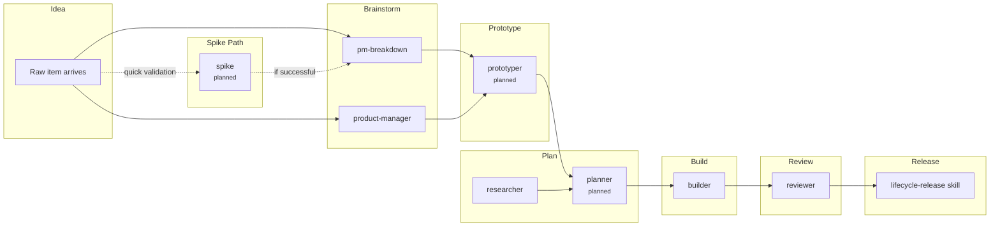
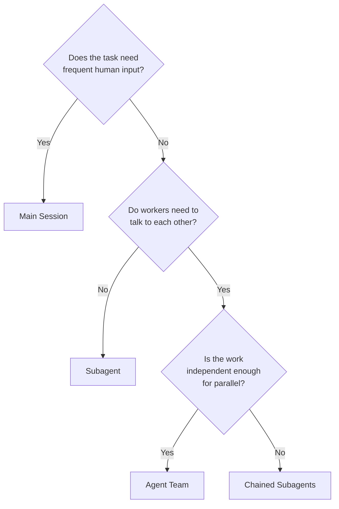

# SS42 Agent Catalogue

Living registry of all agents and skills in the SS42 ecosystem. Each entry includes purpose, tier, configuration, tools, model, guardrails, and status. This catalogue is the practical companion to the [SS42 Agent Architecture Standard](/page/operations/ai-operating-model/architecture) which defines the pattern.

Review this catalogue against emerging Anthropic capabilities and community patterns at least once per quarter.

---

## How to Read This Catalogue

**Status values:**
- **Live** — Agent definition file exists and is in active use
- **In progress** — Being built (tracked in MASTER-TODO)
- **Planned** — Designed but not yet built
- **Proposed** — Concept identified, needs design work

**Tier values:** Human, Role Agent, Workflow Agent, Project Tool, Global Tool (per the four-tier hierarchy)

**Configuration fields** align to Anthropic's official subagent spec (YAML frontmatter in `.md` files):

| Field | Purpose |
|---|---|
| `name` | Unique identifier (lowercase, hyphens) |
| `description` | When Claude should delegate to this agent |
| `tools` | Allowlisted tools |
| `disallowedTools` | Denylisted tools |
| `model` | `haiku`, `sonnet`, `opus`, or `inherit` |
| `permissionMode` | `default`, `acceptEdits`, `dontAsk`, `plan` |
| `maxTurns` | Turn limit before agent stops |
| `skills` | Skills preloaded into agent context |
| `memory` | Persistent memory scope: `user`, `project`, `local` |
| `isolation` | `worktree` for git worktree isolation |
| `background` | `true` to run as background task |
| `hooks` | Lifecycle hooks (PreToolUse, PostToolUse, Stop) |

---

## System Diagram — Agent Interaction Map

```mermaid
graph TD
    Human["Human (Simon)"]

    subgraph "Global Agents"
        researcher["researcher<br/><small>haiku · read-only</small>"]
        builder["builder<br/><small>sonnet · TDD</small>"]
        reviewer["reviewer<br/><small>sonnet · verify</small>"]
        pmBreakdown["pm-breakdown<br/><small>opus · decompose</small>"]
        productManager["product-manager<br/><small>sonnet · PM suite</small>"]
        prototyper["prototyper<br/><small>sonnet · planned</small>"]
        planner["planner<br/><small>sonnet · planned</small>"]
        spike["spike<br/><small>haiku · planned</small>"]
    end

    subgraph "Applyr Agents"
        applyrAgent["applyr-agent<br/><small>role agent</small>"]
        discovery["discovery-agent<br/><small>in progress</small>"]
        application["application-agent<br/><small>in progress</small>"]
        followup["followup-agent<br/><small>in progress</small>"]
        jobResearcher["job-researcher<br/><small>live</small>"]
    end

    subgraph "Global Skills"
        webResearcher["web-researcher"]
        antiSlop["anti-slop"]
        codeQuality["code-quality"]
        infraContext["infra-context"]
        simonContext["simon-context"]
        writingPlans["writing-plans"]
    end

    subgraph "Applyr Skills"
        jobEvaluate["job-evaluate"]
        jobCapture["job-capture"]
        coverLetter["cover-letter"]
    end

    Human --> researcher
    Human --> builder
    Human --> reviewer
    Human --> pmBreakdown
    Human --> productManager
    Human --> prototyper
    Human --> planner
    Human --> spike
    Human --> applyrAgent

    applyrAgent --> discovery
    applyrAgent --> application
    applyrAgent --> followup
    applyrAgent --> jobResearcher

    builder -.-> codeQuality
    builder -.-> infraContext
    reviewer -.-> codeQuality
    planner -.-> writingPlans
    productManager -.-> antiSlop

    discovery --> webResearcher
    discovery --> jobEvaluate
    discovery --> jobCapture
    application --> coverLetter
    jobResearcher --> webResearcher
```

---

## Development Pipeline — Agent Mapping

Shows which agents own which stage of the development pipeline:

---

## Execution Patterns — When to Use What

Anthropic defines three execution mechanisms. SS42 uses all three:

| Mechanism | What it is | When to use | SS42 examples |
|---|---|---|---|
| **Main session** | Human + Claude in conversation | Iterative work, frequent back-and-forth, context-heavy decisions | Brainstorming, design reviews, debugging |
| **Subagents** | Isolated workers that report back | Self-contained tasks, verbose output, tool restrictions needed | researcher, builder, reviewer, spike |
| **Agent Teams** | Mesh network of communicating workers | Parallel work requiring coordination, competing approaches, multi-component features | Parallel research, architecture debates, multi-file feature builds |

**Decision flow:**

---

## Global Agents

### researcher

| Field | Value |
|---|---|
| **Status** | Live |
| **Tier** | Workflow Agent |
| **File** | `~/.claude/agents/researcher.md` |
| **Model** | `haiku` |
| **Tools** | Read, Glob, Grep, Bash (read-only) |
| **DisallowedTools** | Write, Edit |
| **Permission mode** | `plan` |
| **Memory** | None |
| **Skills** | Loads project CLAUDE.md, nas-ops if NAS work |
| **Purpose** | Explores codebase or problem space. Returns structured brief. Never modifies files. |
| **Guardrails** | Read-only Bash only. Cannot write files. Cannot spawn subagents. |
| **Pipeline stage** | Plan (research phase) |

### builder

| Field | Value |
|---|---|
| **Status** | Live |
| **Tier** | Workflow Agent |
| **File** | `~/.claude/agents/builder.md` |
| **Model** | `sonnet` |
| **Tools** | Read, Glob, Grep, Write, Edit, Bash |
| **Permission mode** | `acceptEdits` |
| **Memory** | None (consider `project` scope — see Future Enhancements) |
| **Skills** | code-quality, infra-context, nas-ops/nas-deploy if NAS work |
| **Purpose** | Implements code from a research brief or plan. Follows TDD for every feature and bugfix. |
| **Guardrails** | REQUIRED: follow TDD (write test first, run, implement, verify). No git push. No deployment. |
| **Pipeline stage** | Build |

### reviewer

| Field | Value |
|---|---|
| **Status** | Live |
| **Tier** | Workflow Agent |
| **File** | `~/.claude/agents/reviewer.md` |
| **Model** | `sonnet` |
| **Tools** | Read, Glob, Grep, Bash |
| **DisallowedTools** | Write, Edit |
| **Permission mode** | `default` |
| **Memory** | None (consider `user` scope — see Future Enhancements) |
| **Skills** | code-quality, infra-context |
| **Purpose** | Reviews built code. Runs tests. Loops until PASS. Verifies with real command output, not assumptions. |
| **Guardrails** | REQUIRED: follow verification-before-completion. Cannot modify code — only reports findings. |
| **Pipeline stage** | Review |

### pm-breakdown

| Field | Value |
|---|---|
| **Status** | Live |
| **Tier** | Workflow Agent |
| **File** | `~/.claude/agents/pm-breakdown.md` |
| **Model** | `opus` |
| **Tools** | Read, Glob, Grep, WebSearch |
| **DisallowedTools** | Write, Edit, Bash |
| **Permission mode** | `plan` |
| **Memory** | None |
| **Skills** | None (loaded on demand) |
| **Purpose** | Breaks a product idea into outcome, tasks, and acceptance criteria. |
| **Guardrails** | Read-only. Cannot modify files. Output is a structured brief returned to the main session. |
| **Pipeline stage** | Brainstorm |

### product-manager

| Field | Value |
|---|---|
| **Status** | Live |
| **Tier** | Workflow Agent |
| **File** | `~/.claude/agents/product-manager.md` |
| **Model** | `sonnet` |
| **Tools** | Read, Glob, Grep, Write, Edit, WebSearch |
| **Permission mode** | `default` |
| **Memory** | None |
| **Skills** | Loads only the PM skills needed per task (pm-feature-spec, pm-roadmap-management, etc.) |
| **Purpose** | Full PM agent: specs, roadmaps, competitive briefs, stakeholder comms, research synthesis, metrics. |
| **Guardrails** | Can write files (docs, KB articles). Cannot run code or deploy. |
| **Pipeline stage** | Brainstorm, Plan |

### prototyper (Planned)

| Field | Value |
|---|---|
| **Status** | Planned |
| **Tier** | Workflow Agent |
| **File** | `~/.claude/agents/prototyper.md` (to be created) |
| **Model** | `sonnet` |
| **Tools** | Read, Glob, Grep, Write |
| **DisallowedTools** | Bash, Edit |
| **Permission mode** | `default` |
| **Memory** | None |
| **Skills** | Loads project CLAUDE.md for design context |
| **Purpose** | Takes a scope summary or brainstorm output. Produces a clickable single-file HTML/CSS/JS prototype. Focuses on layout, navigation, and interaction — not production code. Output: `docs/prototypes/{feature}.html`. |
| **Guardrails** | Can only write to `docs/prototypes/`. Cannot run code. Cannot modify existing source files. Prototype is disposable — it informs design, it is not production code. |
| **Pipeline stage** | Prototype |
| **Design notes** | Maps to the Development Platform's "Designer" worker type, scoped to visual artifacts. The Development Pipeline requires a prototype before any UI plan task (UI tasks must reference `spec: {prototype} § {view}`). This agent automates that step. |

### planner (Planned)

| Field | Value |
|---|---|
| **Status** | Planned |
| **Tier** | Workflow Agent |
| **File** | `~/.claude/agents/planner.md` (to be created) |
| **Model** | `sonnet` |
| **Tools** | Read, Glob, Grep, Write |
| **DisallowedTools** | Bash, Edit |
| **Permission mode** | `default` |
| **Memory** | `project` (learns codebase patterns across sessions) |
| **Skills** | writing-plans |
| **Purpose** | Takes a scope summary and optional prototype reference. Produces a seven-field build-ready plan in `docs/plans/`. Writes `plan_reference` back to the ToDo item (when ToDo API is live). |
| **Guardrails** | Can only write to `docs/plans/`. Cannot run code. Cannot modify source files. Plan is reviewed by human before builder starts. |
| **Pipeline stage** | Plan |
| **Design notes** | Bridges the gap between the Decompose Gate (scope summaries) and the build session (seven-field plans). The `writing-plans` skill becomes the engine powering this agent. With `memory: project`, the agent learns which patterns exist in the codebase and references them in future plans without re-exploring. |

### spike (Planned)

| Field | Value |
|---|---|
| **Status** | Planned |
| **Tier** | Workflow Agent |
| **File** | `~/.claude/agents/spike.md` (to be created) |
| **Model** | `haiku` (fast, cheap — spikes are disposable) |
| **Tools** | Read, Glob, Grep, Write, Edit, Bash |
| **Permission mode** | `default` |
| **maxTurns** | 20 (hard cap — spikes are time-boxed) |
| **Memory** | None (spikes are disposable) |
| **Isolation** | `worktree` (experiments on a temporary copy, never touches working tree) |
| **Skills** | None |
| **Purpose** | Takes an idea or question ("Can we do X?"). Writes a few focused tests, builds a minimal working implementation, returns proof of concept with test results. Output is disposable — it answers a question, not builds production code. |
| **Guardrails** | Works on `spike/{topic}` branch via worktree isolation. Never merges to dev without full pipeline. Budget cap: low. Turn limit: 20. If spike succeeds, result feeds back into pipeline at Brainstorm. If spike fails, learning is captured and idea is revised or dropped. |
| **Pipeline stage** | Outside pipeline (fast feedback loop) |
| **Design notes** | This agent has no equivalent in the current architecture. It is an escape hatch for rapid validation before committing to the full pipeline. Anthropic's `isolation: worktree` feature makes this safe — the spike gets a temporary git worktree copy and changes are cleaned up automatically if unused. |

---

## Project Agents — Applyr (Reference Implementation)

### applyr-agent (Planned)

| Field | Value |
|---|---|
| **Status** | Planned (part of Applyr Update Agent sprint) |
| **Tier** | Role Agent |
| **File** | `job-app/.claude/agents/applyr-agent.md` (to be created) |
| **Model** | `inherit` |
| **Purpose** | Conversational entry point for Applyr. Handles ad-hoc requests, delegates to workflow agents for structured jobs. |

### discovery-agent (In Progress)

| Field | Value |
|---|---|
| **Status** | In progress (#106) |
| **Tier** | Workflow Agent |
| **File** | `job-app/.claude/agents/discovery-agent.md` (to be created) |
| **Model** | `sonnet` |
| **Tools** | Read, Glob, Grep, Bash, MCP (Chrome DevTools) |
| **Skills** | web-researcher, job-evaluate, job-capture |
| **Purpose** | Full job discovery cycle: browse job boards, evaluate against criteria, capture scored jobs to Applyr API. |
| **Guardrails** | Max 30 jobs evaluated, max 15 captured per gate. Present scored list before any captures. Stop on API write error. |

### application-agent (In Progress)

| Field | Value |
|---|---|
| **Status** | In progress (#107) |
| **Tier** | Workflow Agent |
| **File** | `job-app/.claude/agents/application-agent.md` (to be created) |
| **Model** | `sonnet` |
| **Skills** | cover-letter, job-profile |
| **Purpose** | Full application cycle: research company, generate cover letter, customise resume, prepare application materials. |

### followup-agent (In Progress)

| Field | Value |
|---|---|
| **Status** | In progress (#108) |
| **Tier** | Workflow Agent |
| **File** | `job-app/.claude/agents/followup-agent.md` (to be created) |
| **Model** | `sonnet` |
| **Skills** | job-profile |
| **Purpose** | Follow-up management: post-interview, stale application, rejection response, offer negotiation. Word count constrained (80-200 words). |

### job-researcher

| Field | Value |
|---|---|
| **Status** | Live |
| **Tier** | Workflow Agent |
| **File** | `job-app/.claude/agents/job-researcher.md` |
| **Model** | `sonnet` |
| **Skills** | web-researcher (after #109) |
| **Purpose** | Deep company and role research for a specific job. Outputs structured research document to `applications/{company}/company-research.md`. |

---

## Future Project Agents (Other Apps)

### kb-agent (Proposed)

| Field | Value |
|---|---|
| **Status** | Proposed |
| **Tier** | Role Agent |
| **Purpose** | Conversational entry point for Knowledge Platform. Ad-hoc queries about KB content, content management, vault operations. |

### todo-agent (Proposed)

| Field | Value |
|---|---|
| **Status** | Proposed |
| **Tier** | Role Agent |
| **Purpose** | Conversational entry point for ToDo app. Task management, sprint operations, item lifecycle queries. |

---

## Model Selection Guidance

Based on Anthropic's recommendations and SS42 experience:

| Model | Cost | Speed | Use for |
|---|---|---|---|
| **Haiku** | Low | Fast | Read-only research, exploration, quick validation. Spike agents. |
| **Sonnet** | Medium | Medium | Implementation, generation, PM work. Most workflow agents. |
| **Opus** | High | Slow | Complex reasoning, architectural decisions, decomposition. pm-breakdown. |

**Rules:**
1. Default to `sonnet` for new agents
2. Use `haiku` when the agent only reads and summarises (researcher, spike)
3. Use `opus` only when the task requires multi-step reasoning across complex domains (pm-breakdown)
4. Use `inherit` for role agents (they should match the session's model)

---

## Memory Strategy

Anthropic's subagent memory system (persistent across sessions) is under-used in SS42 today. Recommended adoption:

| Agent | Memory scope | What it learns |
|---|---|---|
| builder | `project` | Codebase patterns, file conventions, test patterns per project |
| reviewer | `user` | Quality patterns, common issues across all projects |
| planner | `project` | File structure, existing patterns, task sizing accuracy per project |
| prototyper | `user` | Design patterns, component libraries, UI conventions |
| spike | None | Spikes are disposable — no memory needed |
| researcher | None | Research is always fresh — stale memory would be harmful |

Memory is opt-in. Start without it. Add it when you notice an agent repeatedly re-discovering the same information across sessions.

---

## Alignment with Anthropic Best Practices

This catalogue is designed to align with Anthropic's published guidance. Key references:

| Anthropic Pattern | SS42 Implementation | Status |
|---|---|---|
| [Five workflow patterns](https://www.anthropic.com/research/building-effective-agents) (chaining, routing, parallelisation, orchestrator-workers, evaluator-optimizer) | Development Pipeline stages map to chaining. Builder+reviewer is evaluator-optimizer. Parallel research uses parallelisation. | Aligned |
| [Start simple](https://www.anthropic.com/research/building-effective-agents) — only add agents when needed | Human-at-top. Skills before agents. Elevation rule. | Aligned |
| [Subagent design](https://code.claude.com/docs/en/sub-agents) — focused agents with limited tools | Every agent has explicit tool allowlist and guardrails | Aligned |
| [Agent Teams](https://code.claude.com/docs/en/agent-teams) — mesh communication for parallel work | Not yet adopted. See Future Enhancements. | Gap |
| [Progressive disclosure](https://leehanchung.github.io/blogs/2025/10/26/claude-skills-deep-dive/) — load context only when needed | Skills preloaded per agent via `skills` field. Background skills load silently. | Aligned |
| [Persistent memory](https://code.claude.com/docs/en/sub-agents) — agents learn across sessions | Recommended for builder, reviewer, planner, prototyper. Not yet implemented. | Gap |
| [Worktree isolation](https://code.claude.com/docs/en/sub-agents) — safe experimentation | Designed for spike agent. Not yet implemented. | Gap |

---

## Future Enhancements

**Agent Teams adoption:** When a feature spans multiple components (frontend + backend + tests), use Agent Teams with 3 teammates: API specialist, frontend specialist, test specialist. Each works on their domain in parallel, coordinating via shared task list. This replaces the current sequential builder → reviewer pattern for multi-file features.

**MCP tool migration:** When Anthropic's MCP tooling matures for self-hosted use, skills become MCP servers. Any agent can discover and call any tool cross-project. The current skill file pattern maps cleanly onto MCP servers.

**n8n skill invocation:** When n8n can invoke skills via Claude CLI (Mode 2) or MCP (Mode 3), the same agents and skills run in both interactive and automated layers. The skill becomes the shared unit — execution mode is just the trigger.

**Community patterns to watch:**
- Agent OS subagent presets (context-fetcher, file-creator, test-runner, git-workflow)
- Git worktree isolation for parallel design generation
- Multi-agent deep research systems chained with /commands
- Skill marketplace and plugin distribution

---

## Review Schedule

This catalogue should be reviewed:
- When Anthropic releases new agent capabilities (Agent Teams GA, new subagent features)
- When a new SS42 app is scaffolded (add its role agent and workflow agents)
- When an agent is built or its status changes
- Quarterly against community patterns and emerging standards

---

## Related Documents

- [SS42 Agent Architecture Standard](/page/operations/ai-operating-model/architecture) — the pattern
- [Agent Architecture Research](/page/operations/ai-operating-model/agent-research) — industry validation
- [Agent Guardrails Framework](/page/operations/ai-operating-model/agent-guardrails) — safety layer
- [Skills Overview](/page/operations/engineering-practice/skills/skills-overview) — tools inventory
- [ToDo Planning Lifecycle and Agent Roles](/page/products/todo/todo-planning-lifecycle) — how agents connect to the ToDo item lifecycle
- [Applyr Claude Code Architecture](/page/products/applyr/applyr-claude-code-architecture) — reference implementation
- [Development Platform Worker Guardrails](/page/products/development-platform/worker-guardrails) — automated worker types
