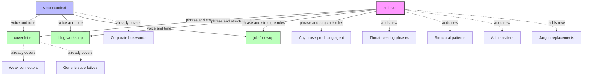

# anti-slop — Skill Reference

**Type:** Claude skill (on-demand, not background)
**Status:** Active — 2026-03-05
**Skill location:** `~/.claude/skills/anti-slop/SKILL.md`
**Upstream source:** [hardikpandya/stop-slop](https://github.com/hardikpandya/stop-slop) (MIT, Hardik Pandya — Atlassian Design Lead)
**Version:** 1.0.0

---

## What it does

Strips predictable AI writing patterns from prose at generation time. Rather than post-processing AI output through a rewriting tool, this skill teaches the model what NOT to write — preventing slop instead of cleaning it up.

It covers three layers:
1. **Banned phrases** — throat-clearing openers, emphasis crutches, filler adverbs, meta-commentary, AI intensifiers
2. **Structural patterns** — binary contrasts, dramatic fragmentation, rhetorical setups, rhythm traps
3. **Scoring framework** — optional 5-dimension evaluation (Directness, Rhythm, Trust, Authenticity, Density) with a 35/50 revision threshold

---

## How it fits in the skill ecosystem



### Ownership boundaries — no overlap

| Domain | Owner | What it covers |
|---|---|---|
| Voice, tone, cognitive style | `simon-context` | How Simon writes. Direct, reflective, no buzzwords, no hype. |
| Cover letter strategy and structure | `cover-letter` | Problem-Solution-Evidence framework, ammunition library, feedback loop. Also bans: "passionate", "synergies", "leverage", "it is worth noting", "proven track record". |
| Blog post process | `blog-workshop` | Conversational discovery, audience calibration, draft iteration. |
| **What NOT to write (phrase + structure level)** | **`anti-slop`** | Specific banned phrases, structural anti-patterns, jargon replacement table, AI intensifier list, scoring framework. |

Each skill owns its domain. anti-slop does not repeat what simon-context or cover-letter already ban.

---

## When to load it

Load anti-slop when producing prose for external audiences:

- **Cover letters** — loaded by cover-letter skill or job-apply workflow
- **Blog posts** — loaded by blog-workshop
- **Follow-up emails** — loaded by job-followup
- **Any agent writing prose** — reference in the agent prompt

**How to reference:** `@~/.claude/skills/anti-slop/SKILL.md`

Do NOT load as a background skill. It is unnecessary for code work, planning, or internal documentation.

---

## What it contains

```
~/.claude/skills/anti-slop/
├── SKILL.md                   # 5 core rules, quick checks, scoring, update instructions
├── references/
│   ├── phrases.md             # ~70 banned phrases with replacements
│   └── structures.md          # ~30 structural patterns to avoid
```

**Total size:** ~5 KB, ~2,000 tokens when loaded.

### Phrases covered (not duplicating other skills)

| Category | Count | Examples |
|---|---|---|
| Throat-clearing openers | 11 | "Here's the thing:", "The uncomfortable truth is", "Let me be clear" |
| Emphasis crutches | 5 | "Full stop.", "Let that sink in.", "Make no mistake" |
| Business jargon (with replacements) | 18 | navigate → handle, delve → examine, deep dive → analysis |
| Filler adverbs | 11 | "At its core", "In today's [X]", "When it comes to" |
| Meta-commentary | 6 | "Plot twist:", "Hint:", "[X] is a feature, not a bug" |
| Performative emphasis | 3 | "creeps in", "I promise" |
| Telling not showing | 3 | "This is genuinely hard", "This is what X actually looks like" |
| AI intensifiers | 9 | deeply, truly, fundamentally, inherently, literally |

### Structural patterns covered

| Category | Count | Key pattern |
|---|---|---|
| Binary contrasts | 9 | "Not because X. Because Y." — state Y directly instead |
| Dramatic fragmentation | 3 | "[Noun]. That's it. That's the [thing]." — complete sentences instead |
| Rhetorical setups | 4 | "What if [reframe]?" — make the point directly |
| Formulaic constructions | 2 | "By the time X, I was Y" — say it plainly |
| Rhythm traps | 9 | Three-item lists, punchy endings, em-dash reveals |
| Word patterns | 2 | Absolute words (always, never), overqualified hedging |

---

## Scoring framework

Optional. Use for important writing (cover letters, published content).

| Dimension | Question | Target |
|---|---|---|
| Directness | Statements or announcements? | 7+ |
| Rhythm | Varied or metronomic? | 7+ |
| Trust | Respects reader intelligence? | 7+ |
| Authenticity | Sounds human? | 7+ |
| Density | Anything cuttable? | 7+ |

**Threshold:** Below 35/50 total — revise before delivering.

---

## Provenance and security

- **Source:** [hardikpandya/stop-slop](https://github.com/hardikpandya/stop-slop) on GitHub
- **Author:** Hardik Pandya — Head of Design & AI Principal at Atlassian. Previously Google Search (Searchbox & Autocomplete), SVP Design at Unacademy.
- **License:** MIT
- **Security review:** 2026-03-05. No code execution, no tool calls, no external URLs, no data exfiltration. Purely instructional text.
- **Repo health:** 318 stars, 36 forks, 5 commits (Jan 2026), stable/complete.

---

## Maintenance

The phrase and structure lists are static markdown. AI writing patterns change slowly — the same tells ("delve into", "at its core", "lean into") have been flagged for over a year.

**To update:**
1. Edit `references/phrases.md` or `references/structures.md` directly
2. Add new entries under the appropriate category heading
3. Check for overlap with simon-context and cover-letter before adding (do not duplicate)
4. Update `last-reviewed` date in SKILL.md frontmatter
5. Update this vault article

**Periodic review cadence:** Every 3 months or when a new upstream commit appears. Check:
- [stop-slop repo](https://github.com/hardikpandya/stop-slop) for community additions
- Search "AI writing patterns [year]" for newly identified tells
- Review cover-letter feedback-log for patterns that should be added

---

## Related documents

- [Claude Workflow — Development Pipeline](../claude-workflow.md) — skill ecosystem overview
- [lifecycle:release — Skill Reference](lifecycle-release.md) — example of another skill reference page
- Cover letter skill: `job-app/.claude/skills/cover-letter/SKILL.md`
- Simon context: `~/.claude/skills/simon-context/SKILL.md`
- Blog workshop: `~/.claude/skills/blog-workshop/SKILL.md`

---

## Alternatives considered

Subscription tools that rewrite AI output after generation (Wordtune, Hemingway Editor Plus, Grammarly AI Humanizer, StealthWriter, HumanizeAI) were evaluated and rejected. They post-process output — this skill prevents slop at generation time, which produces better results and fits the Claude Code skill architecture.
