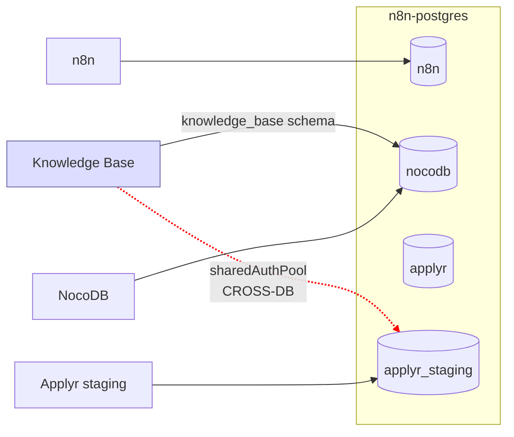
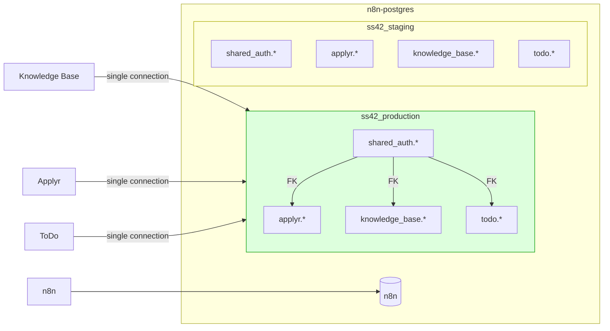

# ADR-002: Database Consolidation — Two-Database Target State

## Decision

Consolidate the current four-database PostgreSQL layout into two databases (`ss42_production`, `ss42_staging`) with schema separation per application. All SS42 apps connect to one database per environment, enabling cross-schema FK constraints and eliminating cross-database connection pools.

## Date

2026-03-18

## Context

The SS42 platform runs a single PostgreSQL instance (`n8n-postgres`, 10.0.3.12) hosting four databases:

- `n8n` — n8n internal data
- `nocodb` — NocoDB tables + `knowledge_base` schema (12 tables)
- `applyr` — Applyr production (15 tables)
- `applyr_staging` — Applyr staging (15 tables + `shared_auth` schema)

The `shared_auth` schema in `applyr_staging` was introduced during SSO migration (Phase 1, 2026-03-03) and creates a cross-database dependency:

1. **KB needs auth data from a different database.** The Knowledge Base app connects to the `nocodb` database for its own data (`knowledge_base` schema) but must maintain a second `sharedAuthPool` connection to `applyr_staging` for `shared_auth` queries (users, sessions, allowed_emails).

2. **Cross-database FK constraints are impossible.** PostgreSQL cannot enforce foreign keys across databases. App tables in `applyr_staging` reference `shared_auth.users(id)` via FK, but KB's `knowledge_base.users` table cannot have FKs to `shared_auth.users` because they are in different databases.

3. **Operational fragility.** Two connection pools per app means two connection strings to manage, two points of failure for connectivity, and two sets of credentials to rotate.

4. **Industry standard.** Related applications sharing one database with schema separation is the established PostgreSQL pattern. Cross-database dependencies are an anti-pattern.

**Source data:**
- Current DB layout: [NAS Containers](/page/operations/infrastructure/nas-containers)
- Auth architecture: [Cross-App Auth Architecture](/page/operations/infrastructure/cross-app-auth-architecture)
- System architecture diagrams: [SS42 System Architecture](/page/operations/infrastructure/ss42-system-architecture) (sections 2 and 3)

## Options Considered

### Option A: Keep separate databases, add connection pooling (rejected)

Retain the four-database layout. Add PgBouncer or a similar connection pooler to reduce the overhead of maintaining multiple pools per app.

**Rejected.** Treats the symptom (connection management) not the cause (data that belongs together is split across databases). FK constraints remain impossible. Every new app that needs shared_auth would add another cross-database pool.

### Option B: Two databases with schema separation (chosen)

Consolidate to two databases:
- `ss42_production` — schemas: `shared_auth`, `applyr`, `knowledge_base`, `todo` (future)
- `ss42_staging` — same schema structure

Keep `n8n` as a separate database (n8n manages its own schema and has no relationship to SS42 app data). NocoDB's original `pys9d495uci8hea` schema data can remain in the `nocodb` database or be migrated if needed.

**Chosen.** Each app connects to one database with one `DATABASE_URL`. Cross-schema FKs become possible. The `shared_auth` → per-app-schema relationship is enforced by PostgreSQL.

### Option C: Single database for all environments (rejected)

One database with environment-specific schemas: `production_applyr`, `staging_applyr`, etc.

**Rejected.** Mixing environments in one database violates isolation. A bad migration on staging could lock production tables. Separate databases per environment is cleaner and allows independent backup/restore.

## Rationale

1. **Eliminates cross-database dependencies.** KB no longer needs a `sharedAuthPool`. One `DATABASE_URL` per app per environment.

2. **Enables FK constraints.** `knowledge_base.users.user_id` can reference `shared_auth.users(id)` directly. PostgreSQL enforces referential integrity.

3. **Simplifies credential management.** One database user per environment instead of one per database. One connection string to rotate.

4. **Scales for new apps.** ToDo, future apps — all get a schema in the consolidated database. No new databases, no new cross-database pools.

5. **n8n stays independent.** n8n has no SS42 data dependency. Keeping it separate avoids coupling the workflow engine to app deployments.

## Architecture

### Before — Current State



The red dashed line is the cross-database dependency — the architectural problem this ADR resolves.

### After — Target State



## Consequences

### Positive

- One `DATABASE_URL` per app per environment — simpler configuration
- Cross-schema FK constraints enforced by PostgreSQL
- KB `sharedAuthPool` eliminated — single pool handles all queries
- New apps (ToDo) get a schema in the existing database — no new databases needed
- Backup/restore operates on one database per environment instead of four

### Negative

- Migration requires downtime or careful live cutover
- All app schemas share the same database user permissions (mitigated by PostgreSQL `GRANT` per schema)
- NocoDB's original data in the `nocodb` database may need separate migration if NocoDB is retired

### Risks

- **Schema name collisions.** Mitigated by convention: each app's schema matches its name (`applyr`, `knowledge_base`, `todo`)
- **Migration data loss.** Mitigated by Phase 1 backup and rollback commands at each phase
- **Connection string rotation.** All apps must be updated simultaneously when credentials change. Mitigated by `shared-secrets.env` single source of truth.

## Migration Plan

Each phase includes rollback commands. Execute in order. Do not skip phases.

### Phase 1: Database Setup

```sql
-- Create the two target databases
CREATE DATABASE ss42_production OWNER nocodb;
CREATE DATABASE ss42_staging OWNER nocodb;

-- Create schemas in ss42_production
\c ss42_production
CREATE SCHEMA shared_auth;
CREATE SCHEMA applyr;
CREATE SCHEMA knowledge_base;

-- Create schemas in ss42_staging
\c ss42_staging
CREATE SCHEMA shared_auth;
CREATE SCHEMA applyr;
CREATE SCHEMA knowledge_base;
```

**Rollback:** `DROP DATABASE ss42_production; DROP DATABASE ss42_staging;`

### Phase 2: Data Migration

```bash
# Dump schemas from current databases
pg_dump -h 10.0.3.12 -U nocodb -d applyr_staging -n shared_auth > shared_auth_dump.sql
pg_dump -h 10.0.3.12 -U nocodb -d applyr_staging -n public > applyr_staging_dump.sql
pg_dump -h 10.0.3.12 -U nocodb -d applyr -n public > applyr_prod_dump.sql
pg_dump -h 10.0.3.12 -U nocodb -d nocodb -n knowledge_base > kb_dump.sql

# Restore into target databases (adjust schema names as needed)
psql -h 10.0.3.12 -U nocodb -d ss42_production < shared_auth_dump.sql
psql -h 10.0.3.12 -U nocodb -d ss42_production < applyr_prod_dump.sql
psql -h 10.0.3.12 -U nocodb -d ss42_production < kb_dump.sql

psql -h 10.0.3.12 -U nocodb -d ss42_staging < shared_auth_dump.sql
psql -h 10.0.3.12 -U nocodb -d ss42_staging < applyr_staging_dump.sql
```

**Rollback:** Drop target databases. Original databases remain untouched until Phase 5.

### Phase 3: Applyr Code Changes

- Schema-qualify all queries (e.g., `SELECT * FROM applyr.jobs` instead of `SELECT * FROM jobs`)
- Update `DATABASE_URL` to point to `ss42_staging` / `ss42_production`
- Remove `search_path` reliance — use explicit schema prefixes
- Update connect-pg-simple config: `schemaName: 'shared_auth'` (already set)

**Rollback:** Revert `DATABASE_URL` to original values.

### Phase 4: KB Code Changes

- Remove `sharedAuthPool` from `services/shared-auth.js` — use the main pool
- Update `DATABASE_URL` to `ss42_production` (production) / `ss42_staging` (staging)
- Schema-qualify `knowledge_base.*` queries
- `shared_auth.*` queries use the same pool (same database now)

**Rollback:** Revert `DATABASE_URL`, restore `sharedAuthPool`.

### Phase 5: Staging Verification

- Deploy updated Applyr and KB to staging containers with new `DATABASE_URL`
- Verify: Google OAuth login, session persistence, data reads/writes
- Verify: cross-schema FK constraints are enforced
- Run full staging verification playbook

**Rollback:** Revert staging containers to original `DATABASE_URL` values.

### Phase 6: Production Cutover

- Schedule brief downtime window
- Update production container `DATABASE_URL` values
- Restart production containers
- Verify all apps authenticate and read/write correctly
- Confirm session cookies still work across apps (SSO)

**Rollback:** Revert production `DATABASE_URL`, restart containers. Original databases still exist.

### Phase 7: Cleanup

- Archive old databases (`applyr`, `applyr_staging`, `nocodb` — keep for 30 days)
- Update `nas-containers.md` with new database details
- Update `cross-app-auth-architecture.md` connection details
- Update `secrets-management.md` credential locations
- Close MASTER-TODO #208

## Related

- [SS42 System Architecture](/page/operations/infrastructure/ss42-system-architecture) — current and target DB diagrams (sections 2 and 3)
- [Cross-App Auth Architecture](/page/operations/infrastructure/cross-app-auth-architecture) — shared_auth schema design
- [NAS Containers](/page/operations/infrastructure/nas-containers) — current database layout
- [ADR-001: Operations Workspace Restructure](/page/operations/ai-operating-model/decisions/001-operations-workspace-restructure) — format precedent
- MASTER-TODO #208 — DB consolidation execution task
- MASTER-TODO #210 — this ADR
