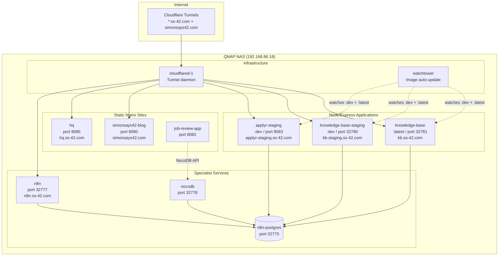
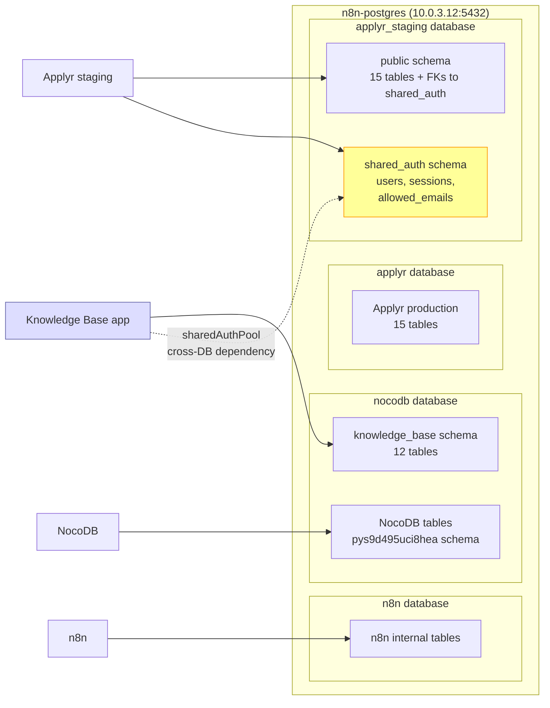
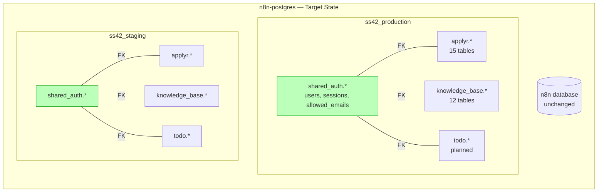
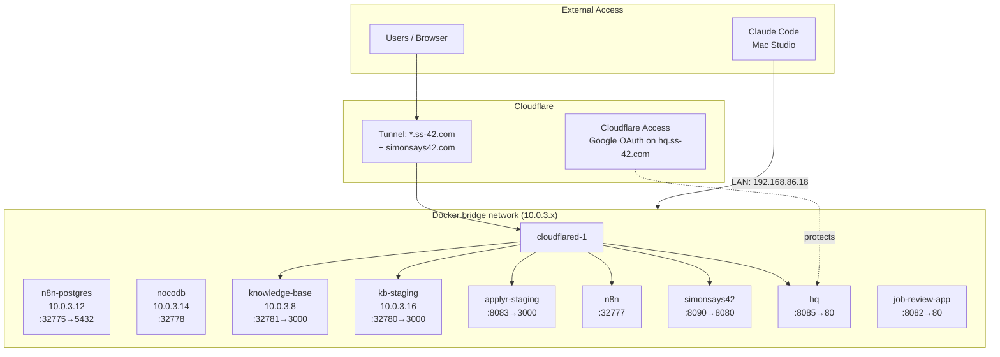
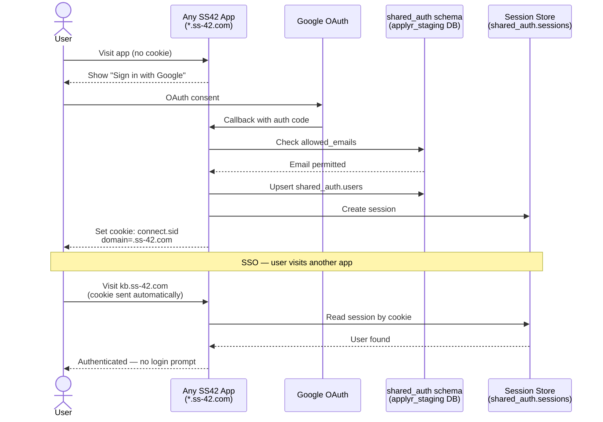
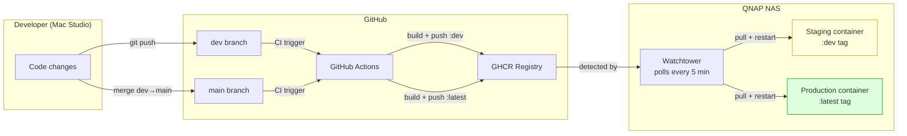

# SS42 System Architecture

Entry point for understanding the SS42 technical platform. All data sourced from the vault articles linked below. For detail on any component, follow the references.

**Source articles:**
- Container inventory: [NAS Containers](/page/operations/infrastructure/nas-containers)
- Auth architecture: [Cross-App Auth Architecture](/page/operations/infrastructure/cross-app-auth-architecture)
- Secrets: [Secrets Management](/page/operations/infrastructure/secrets-management)
- Deployment: [Lifecycle Pattern](/page/operations/engineering-practice/lifecycle-pattern)

---

## 1. Application Topology

Nine containers on a QNAP NAS (192.168.86.18), fronted by Cloudflare Tunnels. Three runtime types: Node/Express applications, static nginx sites, and specialist services.

**Runtime types:**

| Type | Containers | Stack |
|---|---|---|
| Node/Express | knowledge-base, knowledge-base-staging, applyr-staging | Express, PostgreSQL, Passport.js |
| Static nginx | simonsays42-blog, hq, job-review-app | nginx:alpine, static HTML/JS |
| Workflow engine | n8n | n8nio/n8n, PostgreSQL backend |
| Database UI | nocodb | nocodb/nocodb, PostgreSQL |
| Database | n8n-postgres | postgres:16-alpine |

**Not yet containerised:** Applyr production (deployed session 66, not yet in container inventory). ToDo app (planned).

---

## 2. Database Architecture — Current State

A single PostgreSQL instance (`n8n-postgres`) hosts four databases. The `shared_auth` schema in `applyr_staging` creates a cross-database dependency: KB connects to `applyr_staging` via a second connection pool to read auth data.

**Problem:** Cross-database FK constraints are impossible. KB must maintain a separate `sharedAuthPool` connection to `applyr_staging` for auth queries. This creates operational fragility and deployment coupling.

---

## 3. Database Architecture — Target State

Consolidate to two databases with schema separation. All apps connect to one database per environment. Cross-schema FKs become possible. See [ADR-002](/page/operations/infrastructure/decisions/002-db-consolidation) for rationale and migration plan.

**Key change:** One `DATABASE_URL` per app per environment. No cross-database pools. FK constraints enforced by PostgreSQL.

---

## 4. Network Topology

All containers run on the Docker `bridge` network. Internal IPs are in the 10.0.3.x range. External access via Cloudflare Tunnels routes through the `cloudflared-1` container.

**Port assignments:**

| Container | LAN Port | Internal Port | External URL |
|---|---|---|---|
| n8n | 32777 | 5678 | n8n.ss-42.com |
| n8n-postgres | 32775 | 5432 | — (internal only) |
| nocodb | 32778 | 8080 | — (LAN only) |
| knowledge-base | 32781 | 3000 | kb.ss-42.com |
| knowledge-base-staging | 32780 | 3000 | kb-staging.ss-42.com |
| applyr-staging | 8083 | 3000 | applyr-staging.ss-42.com |
| simonsays42-blog | 8090 | 8080 | simonsays42.com |
| hq | 8085 | 80 | hq.ss-42.com |
| job-review-app | 8082 | 80 | — (LAN only) |

---

## 5. Authentication & SSO Flow

Google OAuth with shared PostgreSQL session store. One login works across all `*.ss-42.com` apps. Invite-only via `allowed_emails` table. HQ has an additional Cloudflare Access layer.

**Key components:**

| Component | Detail |
|---|---|
| OAuth provider | Google (one client, multiple redirect URIs) |
| Gate | `shared_auth.allowed_emails` — one row per permitted email |
| Identity | `shared_auth.users` — id, email, google_id, name, avatar_url, is_active |
| Sessions | `shared_auth.sessions` — connect-pg-simple format |
| Cookie | `connect.sid` on `.ss-42.com`, HttpOnly, secure, sameSite: lax, 30-day expiry |
| Session secret | `/share/Container/shared-secrets.env` on NAS — must match across all apps |
| API auth | Separate Bearer token system per app (not session-based) |
| HQ protection | Cloudflare Access (Google OAuth) — independent of app-level auth |

---

## 6. Deployment Pipeline

Git push triggers CI/CD. GitHub Actions builds Docker images, pushes to GHCR. Watchtower on the NAS detects new images and auto-deploys.

**Branch rules:**

| Branch | Image tag | Environment | Deploy method |
|---|---|---|---|
| `dev` | `:dev` | Staging | Auto (Watchtower) |
| `main` | `:latest` | Production | Auto (Watchtower) |

**Exception:** SimonSays42 uses local Docker builds (Hugo multi-stage) — no CI/CD, manual `rsync` + `rebuild.sh` on NAS.

**Release process:** Managed by the `lifecycle:release` skill. Pre-flight checks → commit analysis → version recommendation → confirmation gate → merge, tag, push, GitHub Release, CHANGELOG, KB vault release page. See [Lifecycle Pattern](/page/operations/engineering-practice/lifecycle-pattern).

---

## Infrastructure Roadmap

| Status | Items |
|---|---|
| **Live** | n8n, n8n-postgres, nocodb, job-review-app, knowledge-base (prod + staging), applyr-staging, simonsays42-blog, hq, cloudflared-1, watchtower |
| **Next** | DB consolidation (#210/#208), NAS backup setup (#174), container timezone standardisation (#51) |
| **Planned** | Umami analytics, Dev Platform (Mac Studio containers), ToDo app, Applyr production container inventory update |

---

## References

- [NAS Containers](/page/operations/infrastructure/nas-containers) — authoritative container inventory
- [Cross-App Auth Architecture](/page/operations/infrastructure/cross-app-auth-architecture) — SSO design and migration status
- [Secrets Management](/page/operations/infrastructure/secrets-management) — credential locations and access patterns
- [Lifecycle Pattern](/page/operations/engineering-practice/lifecycle-pattern) — branching, versioning, deployment
- [Staging Verification Playbook](/page/operations/infrastructure/staging-verification-playbook) — pre-release checklist
- [Cloudflare Security](/page/operations/infrastructure/cloudflare-security) — tunnel and Access configuration
