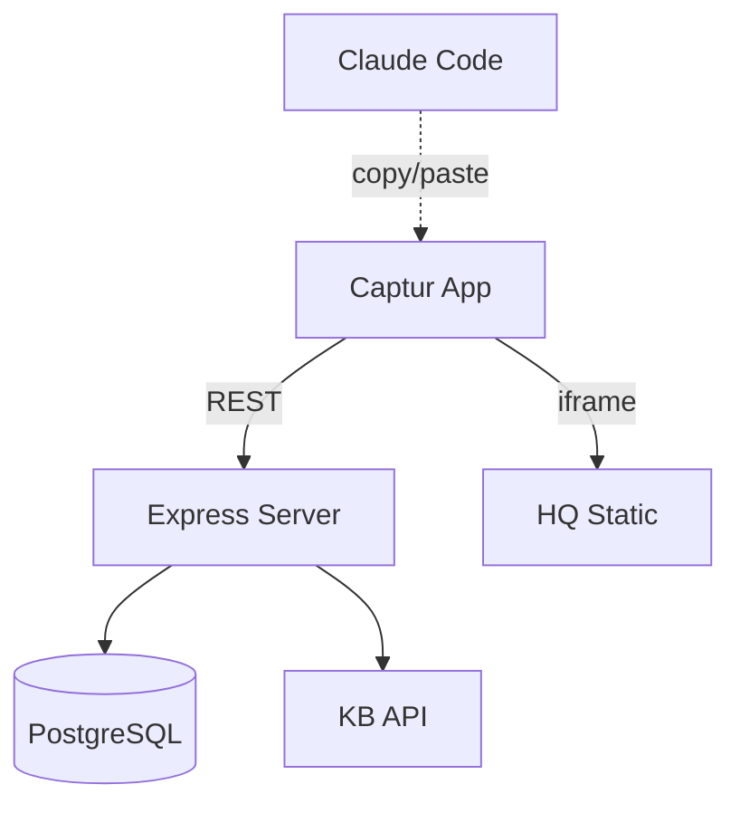
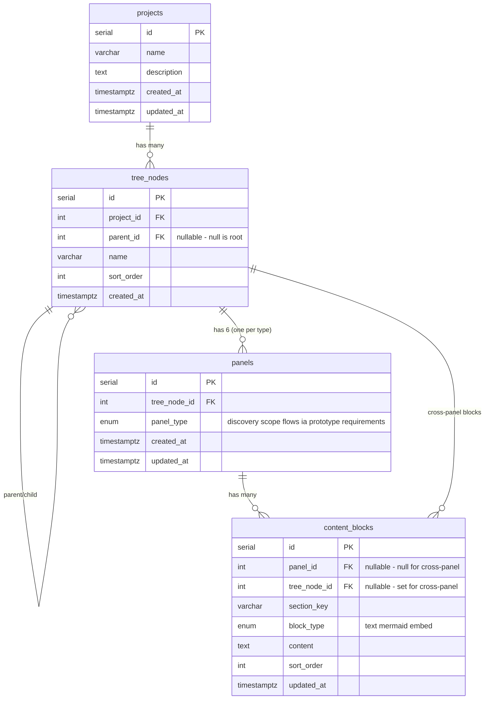
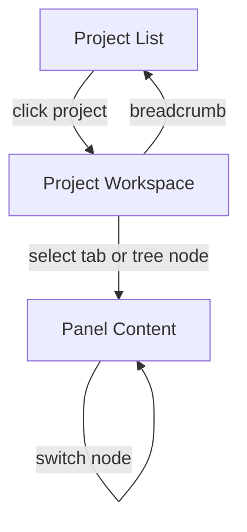
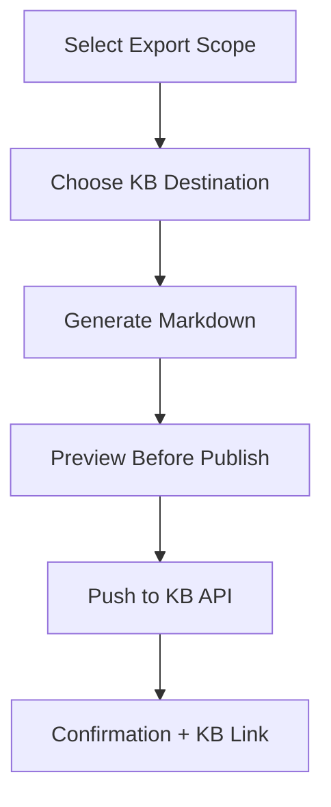

# Captur — Product Scoping Workbench

**Design Spec** | 2026-03-18 | Status: Draft

## 1. What It Is

Captur is a personal product scoping workbench that structures how Simon scopes client projects and internal features. It provides a multi-panel, document-style interface for walking through product development stages — from discovery through requirements — capturing decisions, diagrams, and design artifacts along the way.

It sits in the SS42 app ecosystem alongside Knowledge Base, ToDo, and Applyr, accessible via the shared app rail.

## 2. Why It Exists

**Problem:** Product scoping is currently done ad-hoc across Claude Code sessions. Decisions, user flows, and design rationale are scattered across conversation history, markdown files, and brainstorming session directories. There is no persistent, structured, visual way to revisit scoping work. Prototypes are not captured in the Knowledge Base.

**Solution:** A structured capture layer that guides what needs to be documented at each stage, provides a navigable view for reviewing and updating, and exports artifacts to the Knowledge Base on demand.

**Key principle:** Claude Code remains the thinking engine. Captur is the capture and reference layer. No AI API integration — research and refinement happen in Claude sessions, and refined output is pasted into Captur.

## 3. Who It's For

Simon, used in two contexts:
- **Client scoping** — sitting with a client, walking through stages, capturing detail in real time
- **Internal features** — scoping features for SS42 apps before entering the build pipeline

## 4. System Architecture

### 4.1 Component Overview



**External companion (not integrated):** Claude Code sessions run alongside for research, refinement, and diagram generation. Output is copied into Captur manually.

### 4.2 Technology Stack

| Layer | Technology |
|---|---|
| Server | Node.js / Express |
| Views | Server-side rendered (EJS/HTML) + client-side JS for interactions |
| Database | PostgreSQL — `captur` schema in shared DB |
| Diagrams | Mermaid.js (client-side rendering) |
| Prototypes | iframe embeds from HQ URLs |
| Container | Docker (Node + Nginx) |
| Auth | Cloudflare Access → future shared SSO |

### 4.3 Deployment

| Property | Value |
|---|---|
| Container | `captur` |
| Subdomain (prod) | `captur.ss-42.com` |
| Subdomain (staging) | `captur-staging.ss-42.com` |
| Database | Shared PostgreSQL, `captur` schema |
| CI/CD | `dev` branch → GitHub Actions → `:dev` image → Watchtower |
| Release | `dev` → `main`, `lifecycle:release` skill |

## 5. Data Model

### 5.1 Schema: `captur`

**projects**
| Column | Type | Notes |
|---|---|---|
| id | serial PK | |
| name | varchar(255) | Project name |
| description | text | Optional description |
| created_at | timestamptz | |
| updated_at | timestamptz | |

**tree_nodes**
| Column | Type | Notes |
|---|---|---|
| id | serial PK | |
| project_id | FK → projects | |
| parent_id | FK → tree_nodes (nullable) | null = root node (Project Overview) |
| name | varchar(255) | Node label in sidebar |
| sort_order | integer | Position within siblings |
| created_at | timestamptz | |

**panels**
| Column | Type | Notes |
|---|---|---|
| id | serial PK | |
| tree_node_id | FK → tree_nodes | |
| panel_type | enum | discovery, scope, flows, ia, prototype, requirements |
| created_at | timestamptz | |
| updated_at | timestamptz | |

**content_blocks**
| Column | Type | Notes |
|---|---|---|
| id | serial PK | |
| panel_id | FK → panels (nullable) | null for cross-panel blocks |
| tree_node_id | FK → tree_nodes (nullable) | set for cross-panel blocks (decisions, parking lot, glossary) |
| section_key | varchar(100) | Maps to template section (e.g. `problem_statement`, `features_in_scope`) |
| block_type | enum | text, mermaid, embed |
| content | text | Markdown text, mermaid source, or embed URL |
| sort_order | integer | Position within section |
| updated_at | timestamptz | |

### 5.2 Relationships



- project → tree_nodes (1:many) — project overview is the root node (parent_id = null)
- tree_node → tree_node (self-referential) — unlimited nesting depth
- tree_node → panels (1:6) — one per panel_type, created lazily on first access
- panel → content_blocks (1:many) — ordered content within each template section

## 6. Panel Templates

Each panel has predefined sections with helper prompts. Sections are defined in configuration, not hardcoded — allowing future customisation. Content blocks are created per section as the user fills them in.

### 6.1 Discovery

| Section Key | Section Title | Helper Prompt | Block Types |
|---|---|---|---|
| problem_statement | Problem Statement | What problem does this solve? Why does it need to exist? | text |
| target_users | Target Users / Personas | Who experiences this problem? What are their characteristics? | text |
| current_state | Current State | How is this handled today? What workarounds exist? | text |
| desired_outcome | Desired Outcome | What does success look like? What changes for users? | text |
| context | Context & Background | Relevant history, prior attempts, market context. | text |
| jtbd | Jobs to Be Done | "When [situation], I want to [motivation], so I can [outcome]" | text |
| assumptions | Assumptions & Hypotheses | What are we guessing vs what do we know? What needs validation? | text |
| alternatives | Existing Alternatives | What workarounds, competitors, or manual processes exist today? | text |

### 6.2 Scope

| Section Key | Section Title | Helper Prompt | Block Types |
|---|---|---|---|
| features_in | Features In Scope | What capabilities must this deliver? | text |
| features_out | Out of Scope | What is explicitly excluded? Helps prevent scope creep. | text |
| constraints | Constraints | Technical, business, or timeline limitations that shape decisions. | text |
| success_criteria | Success Criteria | How do we know this is done and working? | text |
| dependencies | Dependencies | What does this depend on or block? | text |
| appetite | Appetite / Time Budget | How much time are we willing to spend? Shape scope to fit. | text |
| nfr | Non-Functional Requirements | Performance, security, accessibility, observability requirements. | text |
| mvp | MVP Definition | What ships first vs what comes later? | text |

### 6.3 User Flows

| Section Key | Section Title | Helper Prompt | Block Types |
|---|---|---|---|
| actors | Actors | Who interacts with the system? Roles, permissions, contexts. | text |
| primary_flows | Primary Flows | Core journeys and happy paths through the system. | text, mermaid |
| edge_cases | Edge Cases | Alternative paths, error states, unusual scenarios. | text |
| state_transitions | State Transitions | Key state changes and what triggers them. | text, mermaid |
| job_stories | Job Stories | "When [situation], I want to [action], so I can [outcome]" — feature-level. | text |
| error_empty | Error & Empty States | What happens when things go wrong or there's no data? | text |
| service_blueprint | Service Blueprint | Frontstage (user actions) / backstage (system) / support processes. | text, mermaid |

### 6.4 Information Architecture

| Section Key | Section Title | Helper Prompt | Block Types |
|---|---|---|---|
| data_model | Data Model | Entities, relationships, attributes. | text, mermaid |
| content_structure | Content Structure | How information is organised and categorised. | text |
| navigation | Navigation | How users move through the system. Primary, secondary, search. | text, mermaid |
| integrations | Integrations | External systems, APIs, data sources. | text |
| url_structure | URL / Route Structure | How URLs map to information architecture. | text |
| permissions | Permissions & Access | Who can see/do what. Roles, visibility rules. | text |
| api_contracts | API Contracts | Endpoints, methods, request/response shapes. | text |

### 6.5 Prototype

| Section Key | Section Title | Helper Prompt | Block Types |
|---|---|---|---|
| design_rationale | Design Rationale | Key visual/UX decisions and why they were made. | text |
| prototype_embeds | Prototype Embeds | Interactive prototypes from HQ or other sources. | embed |
| locked_decisions | Locked Decisions | Design choices that are finalised and should not be revisited. | text |
| open_questions | Open Questions | Unresolved design decisions needing input. | text |
| accessibility | Accessibility Annotations | Tab order, contrast, screen reader behaviour, ARIA labels. | text |
| responsive | Responsive Behaviour | What changes at each breakpoint. Specific adaptations, not just "responsive." | text |

### 6.6 Requirements / PRD

| Section Key | Section Title | Helper Prompt | Block Types |
|---|---|---|---|
| functional | Functional Requirements | What the system must do. Specific, testable. | text |
| non_functional | Non-Functional Requirements | Performance, security, scalability, accessibility, maintainability. | text |
| acceptance | Acceptance Criteria | WHEN [condition] THEN [behaviour]. Testable statements. | text |
| risks | Risks & Mitigations | What could go wrong and how to prevent or recover. | text |
| observability | Observability Plan | What logging, metrics, and alerting ships with this? | text |
| release | Release & Rollback Plan | Deployment strategy, feature flags, how to revert. | text |
| dod | Definition of Done | Beyond code complete: tests, docs, KB, monitoring confirmed. | text |

### 6.7 Cross-Panel Sections

Available in any panel. Stored as content_blocks with `panel_id = null` and `tree_node_id` set to the owning node — they belong to the node, not a specific panel:

| Section Key | Section Title | Helper Prompt | Block Types |
|---|---|---|---|
| decisions | Decision Log | Numbered decisions (D1, D2...) with rationale. | text |
| parking_lot | Open Questions / Parking Lot | Unknowns captured without blocking progress. | text |
| glossary | Glossary | Shared vocabulary for domain-specific terms. | text |

## 7. Navigation & Layout

### 7.1 Three-Level Navigation



**Routes:** `/` → `/projects/:id` → `/projects/:id/:panel`

| Level | View | Navigation Mechanism | Route |
|---|---|---|---|
| 1 | Project List | Landing page, project cards | `/` |
| 2 | Project Workspace | Tree sidebar (left) + tabs (top) + document area (main) | `/projects/:id` |
| 3 | Panel Content | Tab selection + tree node selection, no page reload | `/projects/:id/:panel` |

See design mockup: `ux-design.html`

### 7.2 Layout Structure

The workspace has three columns:

| Column | Width | Contents |
|---|---|---|
| App Rail | 54px | App icons — KB, ToDo, Applyr, Captur |
| Tree Sidebar | 240px | Project overview + nested feature tree |
| Content Area | fluid, max ~800px | Tab bar + scrollable document editor |

See design mockup: `layout-revised.html` (local: `~/Documents/Claude/captur/docs/design/`)

### 7.3 App Rail Integration

Captur appears in the app rail across all SS42 apps:

```javascript
// Added to BUILT_APPS in each app's app.js
{ id: 'captur', label: 'Captur', icon: 'clipboard', url: 'https://captur.ss-42.com', active: false }
```

## 8. Document Editor

### 8.1 Content Block States

| State | Visual | Behaviour |
|---|---|---|
| Empty | Dashed border, placeholder text | Click to start editing |
| Editing | Orange border, active cursor, save/cancel controls | Free text input, supports markdown |
| Filled | Subtle border, rendered content | Edit link on hover, click to re-edit |
| Mermaid | Preview/Source toggle, header bar | Preview renders diagram, Source shows code |
| Embed | iframe with URL input | Loads prototype from URL, shows in panel |

### 8.2 Editing Behaviour

- Click empty section → enters edit mode (orange border, cursor active)
- Paste content from Claude session → appears in edit area
- Ctrl+S or click "save" → persists via API, exits edit mode
- Escape or click "cancel" → discards changes, exits edit mode
- Content supports markdown formatting — rendered on save
- Mermaid blocks: paste mermaid source, toggle to preview to see rendered diagram

### 8.3 Mermaid Diagrams

- Mermaid.js loaded client-side
- Source/Preview toggle in block header
- Source view: monospace textarea for editing mermaid code
- Preview view: rendered diagram
- Supports: flowcharts, sequence diagrams, ER diagrams, state diagrams, class diagrams
- On KB export: mermaid source preserved as fenced code blocks

### 8.4 Prototype Embeds

- Available in the Prototype panel
- User provides a URL (e.g. `https://hq.ss-42.com/prototypes/captur/dashboard.html`)
- iframe renders the prototype inline
- On KB export: generates link + screenshot reference

## 9. Tree Sidebar

### 9.1 Structure

- **Root node** = "Project Overview" (parent_id = null), always exists
- Child nodes = features, sub-features, phases, versions — user-defined labels
- Unlimited nesting depth via self-referential parent_id
- Expand/collapse with ▶/▼ indicators

### 9.2 Interactions

| Action | Mechanism |
|---|---|
| Add root-level item | + button in sidebar header |
| Add child item | Right-click node → "Add child" |
| Reorder | Drag to reorder within siblings |
| Re-parent | Drag onto another node |
| Rename | Right-click → "Rename" or double-click |
| Delete | Right-click → "Delete" (with confirmation) |
| Duplicate | Right-click → "Duplicate" (copies content) |
| Export node | Right-click → "Export to KB" |

### 9.3 Visual States

| State | Visual |
|---|---|
| Active node | Orange left bar + background highlight |
| Node with content | Normal opacity |
| Empty node | Dimmed opacity |
| Hover | Background highlight |

## 10. KB Export

### 10.1 Export Flow



1. **Select scope** — whole project, single tree node, or specific panel
2. **Choose KB destination** — workspace/section path (e.g. `products/captur/`)
3. **Server generates markdown** — text → markdown, mermaid → fenced code blocks, embeds → link + screenshot
4. **Preview** — modal showing generated markdown before sending
5. **Push to KB API** — server-side POST to `kb.ss-42.com/api/pages/by-path`
6. **Confirmation** — success toast with direct link to published page

See design mockup: `ux-design.html`

### 10.2 Export Format

Each panel exports as a markdown document with:
- YAML frontmatter (title, status, author, created/updated dates)
- Section headings matching panel template
- Content blocks as markdown text
- Mermaid blocks as fenced code blocks (````mermaid`)
- Embed blocks as links with screenshot references

### 10.3 KB Structure

Exported content follows the existing vault hierarchy:

```
vault/products/{project-name}/
├── {project}-discovery.md
├── {project}-scope.md
├── {project}-user-flows.md
├── {project}-info-architecture.md
├── {project}-prototype.md
├── {project}-requirements.md
└── features/
    ├── {feature}-discovery.md
    ├── {feature}-scope.md
    └── ...
```

Each panel exports as its own markdown file. Features nest under a `features/` subfolder with the same per-panel structure.

## 11. What Captur Is Not

- **Not an AI tool** — no Claude API integration. Claude Code is the external thinking companion.
- **Not a project management tool** — no tasks, sprints, or timelines. That's ToDo.
- **Not an implementation planner** — implementation plans and validation stay in Claude sessions using the writing-plans skill and plan-reviewer agent.
- **Not a prototype builder** — prototypes are built in Claude sessions as single-file HTML. Captur references and displays them.

## 12. Design Mockups

Interactive HTML mockups created during the brainstorming session. Open locally in a browser, or view on HQ once published.

| File | Contents | Sections Referenced |
|---|---|---|
| approach-overview.html | Three architecture approaches compared (A selected) | §4 Architecture |
| layout-navigation-v1.html | Initial layout — project list, feature list, panel workspace | §7 Navigation (superseded) |
| layout-revised.html | Revised layout — tree sidebar + document editor | §7 Navigation, §8 Editor, §9 Tree |
| architecture-overview.html | System architecture, data model, panel templates, deployment | §4 Architecture, §5 Data Model, §6 Templates |
| ux-design.html | Navigation flow, editor states, KB export flow, tree sidebar | §7 Navigation, §8 Editor, §9 Tree, §10 Export |

**Local path:** `~/Documents/Claude/captur/docs/design/`

**TODO:** Push mockups to `hq.ss-42.com/prototypes/captur/` so links from this page open in a new tab to the hosted version

## 13. Open Decisions

| # | Decision | Options | Notes |
|---|---|---|---|
| 1 | ~~Cross-panel sections storage~~ | ~~Separate table vs content_blocks with flag~~ | Resolved: content_blocks with panel_id=null, tree_node_id set |
| 2 | Panel template customisation | Config file vs DB-driven | Config file for MVP, DB later if needed |
| 3 | Markdown editor library | Plain textarea vs CodeMirror/Monaco | Plain textarea for MVP, upgrade if editing feels limited |
| 4 | Screenshot capture for prototype export | Manual upload vs automated (Puppeteer) | Manual for MVP |
| 5 | Feather Icons icon for app rail | clipboard, layers, box, grid | Match existing rail icon style |
