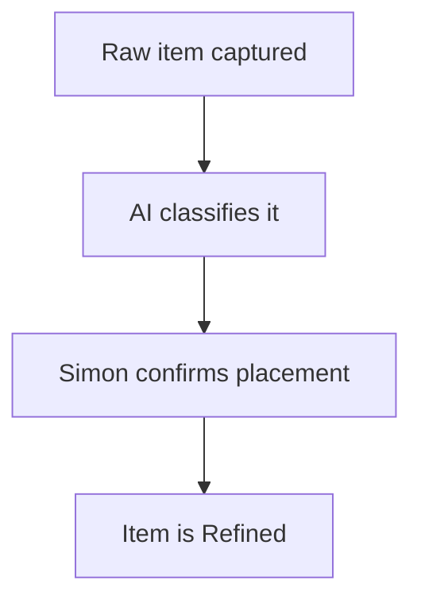

# KB Feature: Mermaid Diagram Rendering

## Summary

Add Mermaid.js to the KB markdown renderer so diagrams authored in fenced code blocks render as interactive SVG in the browser. Authors write plain markdown. Readers see live flowcharts, architecture diagrams, and sequence diagrams.

Tracked in MASTER-TODO #85 (K28 — P2).

---

## Background and Origin

Raised in session 41 (2026-03-06) during the ToDo item lifecycle flow design work.

The session produced a rich HTML design artefact — `todo/docs/plans/2026-03-06-item-lifecycle-flow.html` — that uses Mermaid.js to render three flowchart diagrams alongside custom CSS components (story cards, pipeline stages, styled tables). Simon asked whether this level of richness could live inside the KB.

The assessment was:

| Element | Supported in KB (today) | After Mermaid? |
|---|---|---|
| Markdown tables | ✅ Yes | ✅ Yes |
| Fenced code blocks | ✅ Yes (syntax highlighted) | ✅ Yes |
| Mermaid diagrams | ❌ No | ✅ Yes |
| Custom CSS (colored cards, styled layouts) | ❌ No — needs HTML | ❌ Still no — different document type |

Adding Mermaid delivers the most valuable part of the rich document experience without requiring HTML pages. Most of the information density in the design artefact comes from the flow diagrams, not the card styling.

---

## What It Enables

Any KB page would be able to include a diagram like this:

````

````

...and it renders as an interactive SVG diagram in the browser.

**Diagram types supported by Mermaid:**
- Flowcharts (TD, LR) — process flows, decision trees, lifecycle diagrams
- Sequence diagrams — API call flows, multi-actor interactions
- Architecture diagrams — system component maps, data flows
- Gantt charts — timeline and dependency visualisation
- Entity-relationship diagrams — data model documentation
- Quadrant charts — prioritisation matrices

**Immediate use cases in the KB:**
- ToDo item lifecycle flow (currently in HTML — could be ported to markdown+Mermaid for the diagram sections)
- System architecture diagrams (e.g. SS42 ecosystem map, n8n orchestration flow)
- Product user journey flows
- Skill sequence diagrams
- Dependency chain maps across projects

---

## Reference: The Design Artefact Pattern

The file `todo/docs/plans/2026-03-06-item-lifecycle-flow.html` is the document that prompted this request. It contains:

1. **Section 4 — Full Item Flow** — 18-node Mermaid flowchart covering Capture → Classify → Scope → Decompose → Execute → Write-back → Done
2. **Section 4b — Discovery Session Flow** — 11-node Mermaid flowchart covering the discovery session pattern (flag → evaluate → queue → EOS review → inbox)
3. **Section 8 — System Architecture** — multi-subgraph Mermaid flowchart showing the full technical stack (Simon → Cloudflare → Frontend → API → PostgreSQL → n8n → Claude API)

These three diagrams are what makes the document exceptionally navigable. They are the part that could move into markdown. The styled story cards, colored pipeline stages, and tag components are HTML/CSS and belong in the HTML artefact format.

**Served during development sessions from:** `todo-docs` preview server (port 8772, root: `todo/docs/`)

---

## Implementation Notes

Estimated effort: 2–4 hours (one Claude session).

### Step 1 — Identify the markdown renderer

The KB frontend uses a markdown renderer to convert page content to HTML. Locate: the renderer library used (likely `marked`, `markdown-it`, or `remark`), and the page template where rendered HTML is injected.

### Step 2 — Configure the renderer to pass mermaid blocks through

Most renderers syntax-highlight fenced code blocks. Mermaid blocks need to be emitted as `<div class="mermaid">content</div>` instead.

**If KB uses `marked`:**
```javascript
const renderer = new marked.Renderer();
renderer.code = (code, language) => {
  if (language === 'mermaid') {
    return `<div class="mermaid">${code}</div>`;
  }
  return `<pre><code class="language-${language}">${code}</code></pre>`;
};
marked.use({ renderer });
```

**If KB uses `markdown-it`:**
Use the `markdown-it-mermaid` plugin, or write a custom fence rule for the `mermaid` language.

### Step 3 — Add Mermaid.js to the page template

In the KB page template (wherever article content is rendered), add before `</body>`:

```html
<script src="https://cdn.jsdelivr.net/npm/mermaid@10/dist/mermaid.min.js"></script>
<script>
  mermaid.initialize({
    startOnLoad: true,
    theme: 'dark',
    themeVariables: {
      background: '#0d1117',
      primaryColor: '#0d2b1e',
      primaryTextColor: '#e2e8f0',
      primaryBorderColor: '#10b981',
      lineColor: '#3b82f6',
      fontSize: '13px'
    },
    flowchart: { curve: 'basis', padding: 20 }
  });
</script>
```

Adjust `themeVariables` to match the KB colour palette.

### Step 4 — Add base CSS

```css
.mermaid {
  display: flex;
  justify-content: center;
  margin: 24px 0;
  overflow-x: auto;
  background: var(--surface, #0d1829);
  border: 1px solid var(--border, #1e3a5f);
  border-radius: 6px;
  padding: 24px;
}
```

### Step 5 — Test and verify

Create a test KB page with several diagram types. Verify:
- Diagrams render on page load (no blank boxes)
- Dark theme applies correctly
- Overflow scrolls horizontally on narrow viewports
- Diagrams do not break the page layout

---

## Authoring Constraints

Mermaid is live. These constraints apply to all vault content containing diagrams. The authoritative source is the `kb-writing` skill (`~/.claude/skills/kb-writing/SKILL.md` § Mermaid diagrams).

### What works

- Single-line node labels: `["Web Server · Port 8080"]`
- `·` as a visual separator within labels
- Subgraph labels: `subgraph Name["Display Label"]`
- Style directives: `style NodeId fill:#hex,stroke:#hex`
- All standard Mermaid diagram types (flowchart, sequence, state, ER, Gantt)

### What does not work

| Syntax | Problem |
|---|---|
| `<br/>`, `<i>`, `<b>` in labels | Silently rejected — diagram renders as empty box |
| `\n` in labels | Passed as literal characters, not line breaks — diagram renders as empty box |
| `graph LR` with many nodes | Compressed horizontally into page width — unreadable |

### Orientation rule

**Use `graph TD` (top-down) by default.** Left-to-right (`graph LR`) diagrams get squeezed into the page container width and become unreadable when they have more than 2-3 nodes. Top-down diagrams use vertical space and render at readable size within the KB page layout.

### Why HTML is blocked

The KB initialises Mermaid v11 with the default `securityLevel` (not `'loose'`). This is intentional — loose mode enables XSS via SVG injection. The secure default is the correct setting. Diagrams must use Mermaid-native syntax only.

---

## Design Artefact Document Type (Future Enhancement)

Once Mermaid is live in markdown, a follow-on enhancement would be a "design artefact" page type that embeds standalone HTML files. This would let documents like the ToDo item lifecycle flow HTML live natively inside the KB — accessible by URL, indexed by the KB, but rendering the full HTML experience.

Implementation sketch:
- KB page record with `page_type: 'html'` and a `file_path` field pointing to the artefact
- Page view renders an `<iframe>` or full-page embed instead of the markdown renderer
- Files stored alongside vault markdown in `docs/artefacts/` or similar

This is separate from and lower priority than Mermaid rendering. Mermaid in markdown is the immediate win.

---

## Related

- MASTER-TODO #85 (K28 — P2) — tracks the build task
- `todo/docs/plans/2026-03-06-item-lifecycle-flow.html` — reference artefact (3 Mermaid diagrams)
- `products/knowledge-base/kp-feature-status.md` — KB feature status
