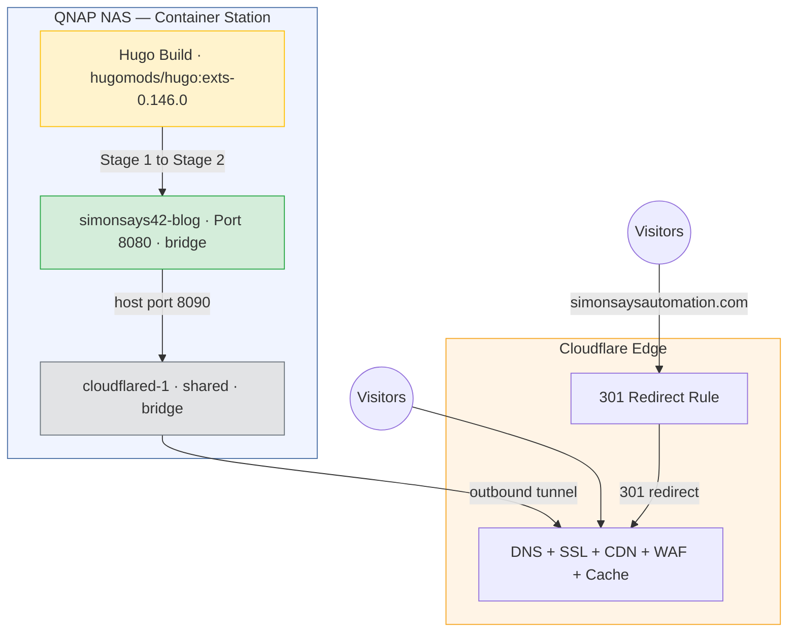
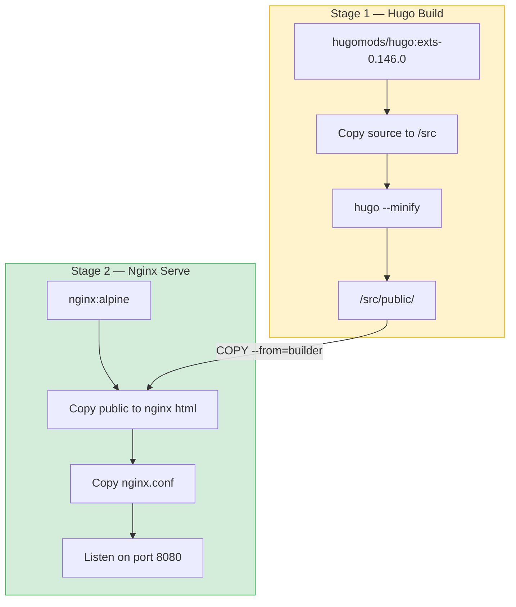
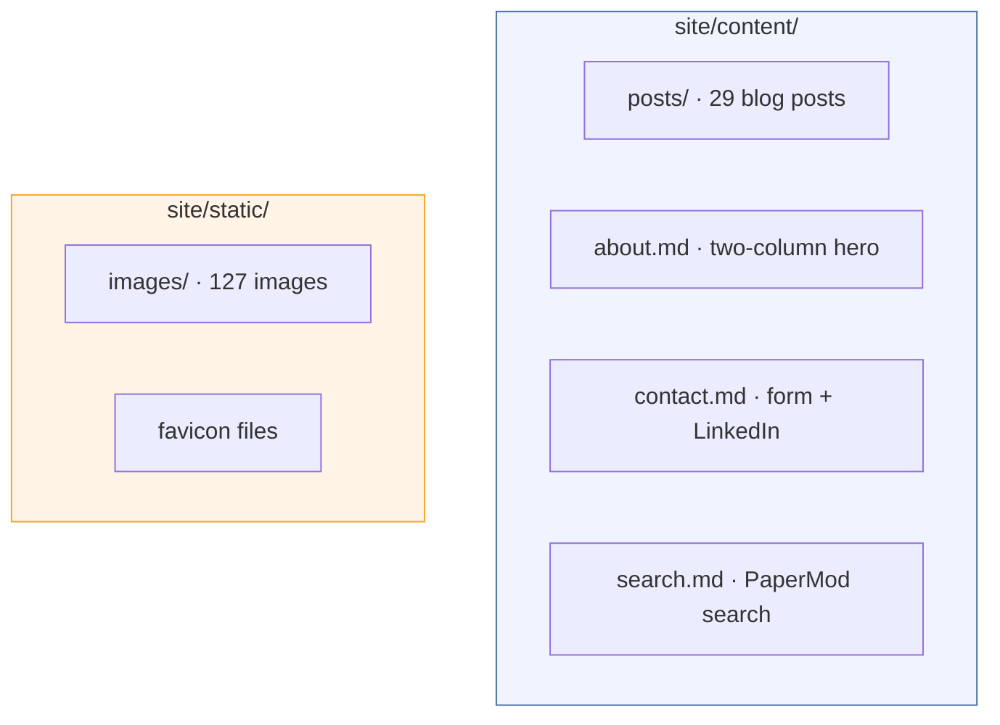
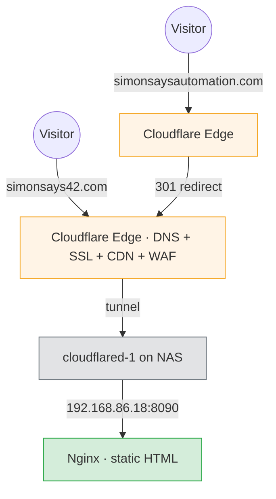
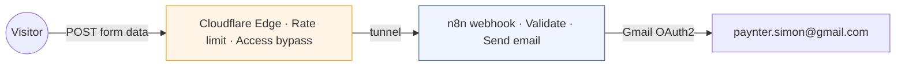

# SimonSays42 — Architecture

## System overview

SimonSays42 is a static site. There is no application server, no database, and no runtime logic. Hugo generates HTML at build time. Nginx serves it. Cloudflare handles everything between the visitor and the NAS.



## Build pipeline

The site uses a multi-stage Docker build. Hugo runs once at build time to generate static HTML, then Nginx serves the output.



The final container is small (~25 MB) — just Nginx plus the built HTML, CSS, and images.

## Docker Compose

Single service in `docker-compose.yml`:

| Service | Container name | Image | Network | Purpose |
|---|---|---|---|---|
| `blog` | `simonsays42-blog` | Built from Dockerfile | bridge | Hugo build + Nginx serve |

The blog container uses `network_mode: bridge` to join the standard Docker bridge network (`10.0.3.x`), consistent with all other NAS containers. The shared `cloudflared-1` container (standalone, not part of this compose file) handles tunnel routing for all services including this one.

There is no per-project cloudflared service. The tunnel route `simonsays42.com → http://192.168.86.18:8090` is configured in the shared Cloudflare Tunnel via API.

## Nginx configuration

Custom `nginx.conf` provides:

- **Security headers:** X-Frame-Options, X-Content-Type-Options, X-XSS-Protection, Referrer-Policy, Content-Security-Policy, Permissions-Policy
- **Server tokens off** — no version disclosure
- **Gzip compression** for text, CSS, JS, JSON, XML, SVG
- **Static asset caching** — 30-day expiry with `immutable` for CSS, JS, images, fonts
- **HTML caching** — 1-hour expiry (Cloudflare handles edge caching)
- **Pretty URLs** — `try_files` handles Hugo's clean URL structure
- **Custom 404** — serves Hugo's generated 404 page
- **Hidden file blocking** — denies access to dotfiles

## Hugo configuration

Config file: `site/hugo.toml`

| Setting | Value |
|---|---|
| Theme | PaperMod |
| Language | en-au |
| Default theme | light |
| Pagination | 6 posts per page (optimised for 3-column grid) |
| Outputs | HTML, RSS, JSON (JSON enables search) |
| Markdown renderer | Goldmark with unsafe HTML enabled |

### Features enabled

- Reading time on posts
- Share buttons (X and LinkedIn only)
- Post navigation links (prev/next)
- Breadcrumbs
- Code copy buttons
- Fuse.js search (via JSON output)
- Table of contents (disabled by default, per-post override available)

### Menu structure

| Item | URL | Weight |
|---|---|---|
| Blog | `/posts/` | 10 |
| About | `/about/` | 20 |
| Contact | `/contact/` | 30 |
| Search | `/search/` | 40 |

## Template overrides

PaperMod templates are overridden at `site/layouts/` when the theme defaults need structural changes:

| Override | Purpose |
|---|---|
| `layouts/partials/header.html` | Logo image only (no text label), theme toggle moved to end of nav menu |

Custom CSS is in `site/assets/css/extended/custom.css` — PaperMod's supported extension point. This includes:
- Sora font import (matches WordPress design)
- Orange accent colour (`#ED4C05`)
- 3-column responsive homepage grid
- About page two-column layout
- Header padding and theme toggle styling

## Content structure



### Post frontmatter format

Each post uses Hugo frontmatter:

```yaml
---
title: "Post Title"
date: 2025-06-15
draft: false
tags: ["technology", "ai"]
categories: ["Blog"]
summary: "Brief description for listing pages"
cover:
  image: "images/filename.jpg"
  alt: "Description of the image"
  hidden: false
---
```

The `cover` block is PaperMod-specific. It displays a featured image at the top of the post and as a thumbnail in the blog listing.

## Network topology

| Endpoint | Port | Access |
|---|---|---|
| Nginx (internal) | 8080 | Container network only |
| NAS host mapping | 8090 → 8080 | LAN access at `192.168.86.18:8090` |
| Cloudflare Tunnel | — | `simonsays42.com` (public) |

No inbound ports are exposed to the internet. The cloudflared container maintains an outbound-only connection to Cloudflare's edge network. Cloudflare terminates SSL and proxies requests through the tunnel.

## DNS and domain management

Two domains serve the site. Both are managed through Cloudflare.

### simonsays42.com (primary)

| Setting | Value |
|---|---|
| Registrar | WordPress.com (Automattic) — transfer to Cloudflare Registrar initiated 2026-03-13, pending release |
| Cloudflare zone ID | `9ec8fefc0cb4ff7d0e667a5a9d13a2d8` |
| Nameservers | `lauryn.ns.cloudflare.com`, `malcolm.ns.cloudflare.com` |
| DNS record | CNAME `simonsays42.com` → `3d7a132e-f8d9-4fb2-932d-e604d33d1dd1.cfargotunnel.com` (proxied) |

The CNAME points directly at the Cloudflare Tunnel. Because the record is proxied (orange cloud), Cloudflare resolves visitor requests through its edge network, terminates SSL, and forwards traffic through the tunnel to the Nginx container on the NAS.

Nameservers were changed from WordPress.com defaults (`ns1/ns2/ns3.wordpress.com`) to Cloudflare on 2026-03-13.

### simonsaysautomation.com (redirect)

| Setting | Value |
|---|---|
| Registrar | Cloudflare Registrar |
| Cloudflare zone ID | `1840c23412a67723d4d756e4c8800691` |
| Zone status | Active |
| DNS records | A records pointing to legacy WordPress IPs (192.0.78.24/25), proxied |
| Redirect | 301 → `https://simonsays42.com/` (Cloudflare redirect rule) |

The A records still point at WordPress IPs, but because they are proxied through Cloudflare, traffic never reaches WordPress. Cloudflare intercepts the request at the edge and applies a 301 redirect to `simonsays42.com`. The A record IPs are effectively placeholders.

This domain also retains MX records for Office 365 email (`simonsaysautomation-com.mail.protection.outlook.com`).

### Domain transfer

`simonsays42.com` was registered at WordPress.com (Automattic). Transfer to Cloudflare Registrar was initiated on 2026-03-13.

| Step | Status |
|---|---|
| Domain unlocked at WordPress.com | Done |
| Auth/EPP code obtained | Done |
| Transfer initiated at Cloudflare dashboard | Done (2026-03-13) |
| Payment confirmed | Done |
| Waiting for previous registrar to release | In progress |
| Transfer complete | Pending (5-7 days from initiation) |

ICANN rules require a 1-year extension on every .com transfer. Cloudflare charges at-cost (~$10/year). The domain was renewed on 2026-03-12, so the new expiry will be approximately 2027-04-11 once the transfer completes.

The nameserver change and domain transfer are independent. The site works via tunnel regardless of which registrar holds the domain.

### Request flow



## Resource usage

| Container | RAM | CPU | Storage |
|---|---|---|---|
| Nginx (blog) | ~10-15 MB | Negligible | ~50 MB (site files) |

The cloudflared container is shared across all services and is not counted per-project.

## How to rebuild

After changing content or config:

```bash
# From Mac — rsync then rebuild
rsync -avz --delete --exclude '.git' --exclude 'public' --exclude 'resources' \
  ~/Documents/Claude/simonsays42/site/ nas:/share/Container/simonsays42/

ssh nas "cd /share/Container/simonsays42 && ./rebuild.sh"
```

`rebuild.sh` uses the full Container Station docker path:
```bash
DOCKER="/share/CACHEDEV2_DATA/.qpkg/container-station/usr/bin/.libs/docker"
$DOCKER stop simonsays42-blog 2>/dev/null || true
$DOCKER rm simonsays42-blog 2>/dev/null || true
$DOCKER compose build --no-cache blog
$DOCKER compose up -d blog
```

This rebuilds Stage 1 (Hugo generates fresh HTML) and Stage 2 (new Nginx container with updated content), then restarts the blog service. The shared `cloudflared-1` tunnel container is unaffected.

## LAN preview

The site is accessible on LAN at `http://192.168.86.18:8090`. However, Hugo generates absolute URLs using the `baseURL`, so images and links point to `https://simonsays42.com/` which may not resolve correctly before DNS cutover.

**Preview options:**

1. **Hosts file:** Map the domain to the NAS locally:
   ```bash
   sudo sh -c 'echo "192.168.86.18 simonsays42.com" >> /etc/hosts'
   ```
   Then open `http://simonsays42.com:8090`. Remove after: `sudo sed -i '' '/192.168.86.18 simonsays42.com/d' /etc/hosts`

2. **Temporary baseURL:** Change the Dockerfile `--baseURL` to `http://192.168.86.18:8090/`, rebuild, preview, then change back.

**Known gotcha:** If the domain was previously served with HSTS (e.g. by WordPress), the browser forces HTTPS even with a hosts file override. Use an incognito window to bypass cached HSTS.

**PaperMod limitation:** Hugo's `relativeURLs = true` does NOT work for PaperMod cover images. The theme uses `| absURL` in its templates (`cover.html` line 22), which always generates absolute URLs regardless of the relativeURLs setting.

## How to add or edit content

See `simonsays42-content-workflow.md` for the full content authoring workflow.

Quick reference:
1. Create or edit a markdown file in `site/content/posts/`
2. Add YAML frontmatter (title, date, tags, cover image)
3. Write content in markdown (images reference `images/filename.jpg`)
4. Rsync to NAS and run `rebuild.sh`

## Contact form

The contact page includes a form that submits to an n8n webhook. Because Hugo produces static HTML (no server-side processing), the form uses JavaScript fetch from the visitor's browser.



**Request flow:** Browser → Cloudflare (rate limiting: 3 reqs/10s/IP) → Access bypass for `/webhook` path → n8n webhook → validate fields + honeypot check → send Gmail notification → return JSON response.

**n8n workflow:** `Contact Form (simonsays42.com)` (ID: `LWvkUvxSgdsH3cyA`)

| Node | Purpose |
|---|---|
| Contact Webhook | Receives POST at `/webhook/contact`, CORS restricted to `simonsays42.com` |
| Validate Fields | Checks name, email, message not empty; honeypot field (`website`) must be empty |
| Send Email | Gmail OAuth2 to `paynter.simon@gmail.com` with reply-to set to submitter's email |
| Success Response | Returns `{"success": true}` (200) |
| Error Response | Returns `{"success": false}` (400) for validation failures |

**Security layers:**

| Layer | Protection | Scope |
|---|---|---|
| Cloudflare rate limiting | 3 POST requests per 10s per IP, then block | Zone-wide rule on `ss-42.com` |
| Cloudflare Access bypass | Only `/webhook` path is public; n8n dashboard remains protected | Path-scoped Access app |
| Honeypot field | Hidden `website` field — bots fill it, humans do not | Form + workflow validation |
| Field validation | Rejects empty name, email, or message | Workflow logic |
| CORS restriction | Webhook only accepts requests from `simonsays42.com` origin | n8n webhook config |

See `operations/infrastructure/cloudflare-security.md` for the full Cloudflare security documentation.

## Security model

- **No exposed ports** — tunnel is outbound-only
- **No application server** — static HTML cannot be exploited like PHP or Node.js
- **No database** — nothing to inject into or dump
- **Cloudflare rate limiting** — contact form webhook rate-limited at 3 reqs/10s/IP
- **Cloudflare Access** — n8n dashboard protected; webhook path bypassed with layered defence
- **SSL/TLS** — Cloudflare handles certificates automatically (Full Strict mode)
- **Security headers** — set by Nginx (CSP, HSTS via Cloudflare, X-Frame-Options)
- **Minimal container** — Alpine-based Nginx, small attack surface
