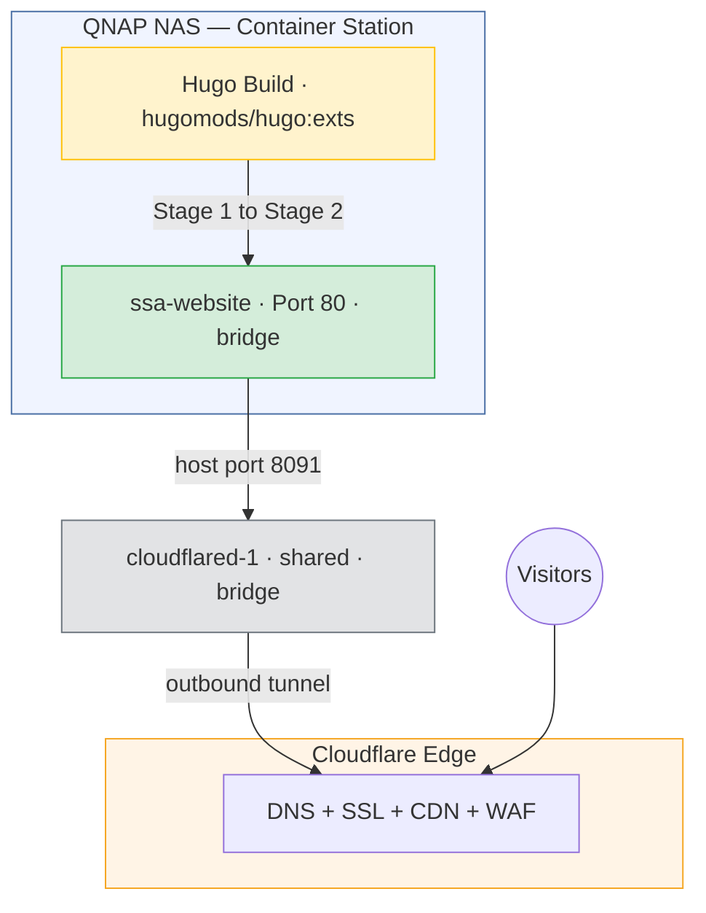
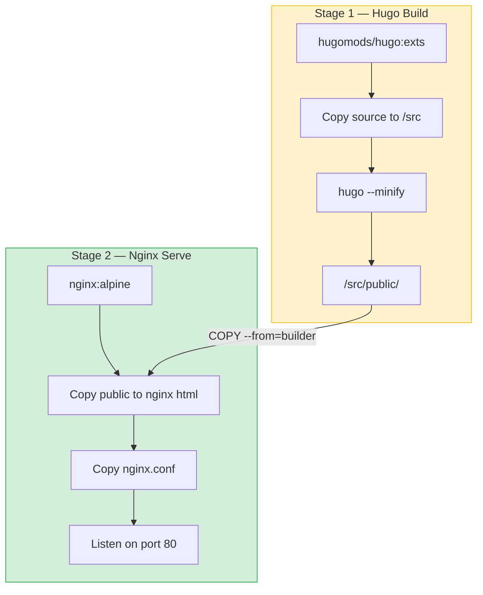
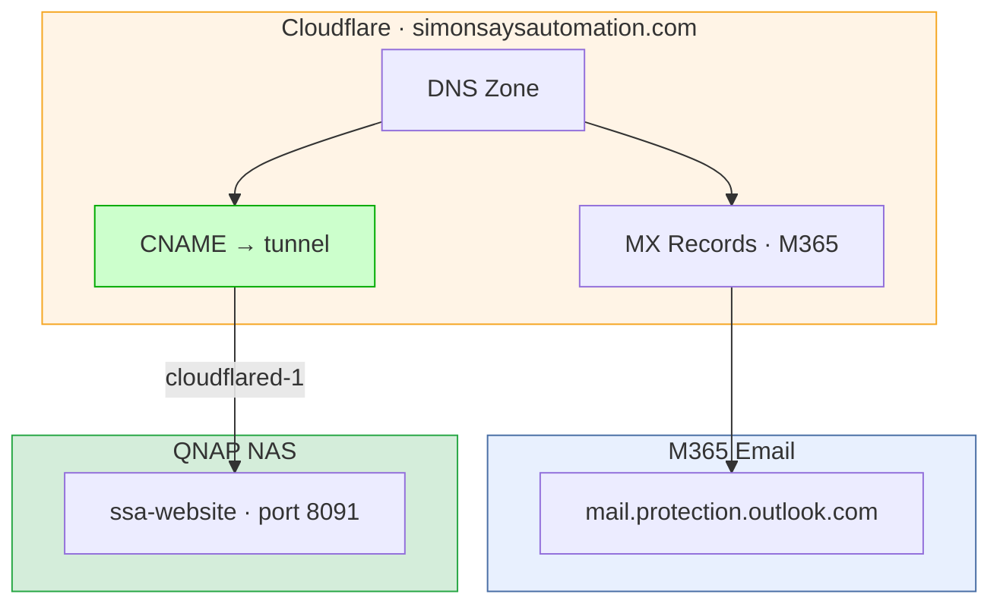
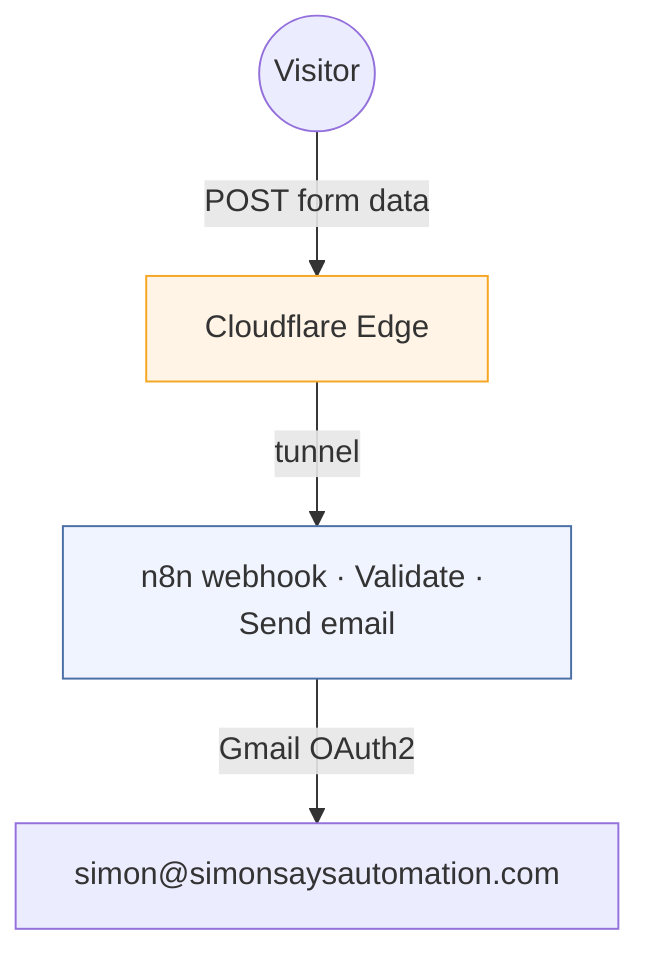

# SSA Website — Architecture

## System overview

SSA Website follows the same static site pattern as SimonSays42: Hugo generates HTML at build time, Nginx serves it, Cloudflare handles everything between the visitor and the NAS.

The site is a single-page design (not a multi-page blog), so the Hugo content model is simpler — four sections rendered on one page, plus a contact form.



## Current state: Hugo build (live)

The site is live at `https://simonsaysautomation.com` as of 2026-03-18. Hugo multi-stage Docker build matching the simonsays42 pattern:

| Setting | Value |
|---|---|
| Container name | `ssa-website` |
| Image | `ssa-website-web` (built from Dockerfile) |
| Network | bridge |
| Host port | 8091 → 80 |
| Source directory | `/share/CACHEDEV1_DATA/Container/ssa-website/` |
| LAN access | `http://192.168.86.18:8091` |
| Public URL | `https://simonsaysautomation.com` |
| Cloudflare Tunnel | `simonsaysautomation.com` + `www.simonsaysautomation.com` → `http://192.168.86.18:8091` |

## Build pipeline



### Docker Compose

Single service, same pattern as simonsays42:

| Service | Container name | Image | Network | Port |
|---|---|---|---|---|
| `web` | `ssa-website` | Built from Dockerfile | bridge | 8091 → 80 |

### Nginx configuration

- Security headers (X-Frame-Options, CSP, X-Content-Type-Options, Referrer-Policy, Permissions-Policy)
- Server tokens off
- Gzip compression for text, CSS, JS, JSON, XML, SVG
- Static asset caching (30-day immutable for CSS/JS/images/fonts)
- HTML caching (1 hour)
- Pretty URLs via `try_files`
- Custom 404 page
- Hidden file blocking

## Hugo configuration

| Setting | Value |
|---|---|
| Theme | Custom (SSA design language from prototype) |
| Language | en-au |
| Base URL | `https://simonsaysautomation.com/` (production) |
| Outputs | HTML only (no RSS, no JSON search — single page site) |

Key difference from simonsays42: SSA uses a **custom theme** built from the prototype, not PaperMod. The design language (Archivo font, orange #ED4C05, frosted glass nav, scroll animations) is specific to SSA.

## Content structure

The site is a single page with four sections, not a blog with multiple posts:

```
site/content/
├── _index.md          ← single page with all four sections
└── (no posts/)
```

Content is defined in `docs/site-content.md`. The Hugo template renders all sections from a single content file or from data templates.

## Network topology

| Endpoint | Port | Access |
|---|---|---|
| Nginx (internal) | 80 | Container network only |
| NAS host mapping | 8091 → 80 | LAN at `http://192.168.86.18:8091` |
| Cloudflare Tunnel | — | `simonsaysautomation.com` + `www.simonsaysautomation.com` |

## DNS and domain management

### simonsaysautomation.com

| Setting | Value |
|---|---|
| Registrar | Cloudflare Registrar |
| Cloudflare zone ID | `1840c23412a67723d4d756e4c8800691` |
| State | Live — tunnel route to `http://192.168.86.18:8091` (go-live 2026-03-18) |



### Go-live completed (2026-03-18)

1. Removed Cloudflare 301 redirect rule (was redirecting to simonsays42.com)
2. Deleted legacy A records (192.0.78.24, 192.0.78.25)
3. Created CNAME pointing to Cloudflare tunnel
4. Added tunnel ingress for `simonsaysautomation.com` and `www.simonsaysautomation.com`
5. Verified MX records preserved — M365 email confirmed working
6. Verified site loads at `https://simonsaysautomation.com` with security headers

### DNS records to preserve

| Type | Name | Value | Purpose |
|---|---|---|---|
| MX | simonsaysautomation.com | `simonsaysautomation-com.mail.protection.outlook.com` | M365 email routing |
| TXT | simonsaysautomation.com | SPF record (if present) | Email authentication |
| CNAME | autodiscover | M365 autodiscover endpoint (if present) | Outlook auto-config |

## Contact form

Same pattern as simonsays42: browser-side fetch to n8n webhook, n8n validates and sends email.



Security layers: honeypot field, Cloudflare rate limiting, field validation, CORS origin restriction to `simonsaysautomation.com`.

## Rebuild and deployment

```bash
# From Mac — rsync source then rebuild
rsync -avz --delete --exclude '.git' --exclude 'public' --exclude 'resources' \
  ~/Documents/Claude/SSA\ website/site/ nas:/share/CACHEDEV1_DATA/Container/ssa-website/

ssh nas "cd /share/CACHEDEV1_DATA/Container/ssa-website && ./rebuild.sh"
```

`rebuild.sh` follows the same pattern as simonsays42:

```bash
DOCKER="/share/CACHEDEV2_DATA/.qpkg/container-station/usr/bin/.libs/docker"
$DOCKER stop ssa-website 2>/dev/null || true
$DOCKER rm ssa-website 2>/dev/null || true
$DOCKER compose build --no-cache web
$DOCKER compose up -d web
```

## SEO and discoverability

Added 2026-03-19. Goal: branded search indexing ("Simon Says Automation", "Simon Paynter automation consulting").

**Google Search Console:** Verified via DNS TXT record. Sitemap submitted (`/sitemap.xml`, auto-generated by Hugo).

**robots.txt:** `site/static/robots.txt` — permissive, points to sitemap. Hugo copies to root on build.

**Open Graph + Twitter Card:** Meta tags in `baseof.html` for social sharing previews. OG image (`/images/og-image.png`, 1200x630) shows SSA logo + cartoon Simon character on dark background.

**Canonical URL:** `<link rel="canonical">` using Hugo's `.Permalink`.

**JSON-LD structured data:** Three schema.org entities in `baseof.html`:
- `Organization` — Simon Says Automation, logo, description
- `ProfessionalService` — AI Consulting + Business Process Automation Consulting, Melbourne AU
- `Person` — Simon Paynter, AI Automation Consultant

**Locale:** `<html lang="en-AU">`, `og:locale = en_AU`, `languageCode = "en-au"` in hugo.toml.

Design spec: `docs/superpowers/specs/2026-03-19-ssa-seo-foundations-design.md`

## Resource usage

| Container | RAM | CPU | Storage |
|---|---|---|---|
| Nginx (test hosting) | ~5 MB | Negligible | ~200 KB (mockup files) |
| Nginx (Hugo build, target) | ~10-15 MB | Negligible | ~5-10 MB (built site) |

## Differences from SimonSays42

| Aspect | SimonSays42 | SSA Website |
|---|---|---|
| Type | Blog (multi-page, 30+ posts) | Single-page services site |
| Theme | PaperMod | Custom (from prototype) |
| Content model | Posts with frontmatter | Single page, four sections |
| Search | Fuse.js via JSON output | Not needed |
| RSS | Yes | No |
| Decap CMS | Configured | Not needed |
| Port | 8090 | 8091 |
| Domain | simonsays42.com | simonsaysautomation.com |
