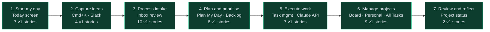

# ToDo — User Story Map

**Type:** Product artefact — Story Map
**Workspace:** Products
**Section:** ToDo
**Framework:** Jeff Patton — User Story Mapping (endorsed by Marty Cagan, Inspired 2nd ed. Ch. 38)
**Status:** v1 baseline — Gate 3 complete, Gate 4 (build) next
**Created:** 2026-03-04 (session 36)
**Author:** Simon Paynter + Claude

---

## How to read this map

**Backbone (horizontal)** — The user's narrative. The activities Simon performs in sequence across a working day and working week. These never change — they are the core jobs the product supports.

**Walking skeleton (features)** — The key capabilities within each activity. These are what the product provides to support each activity.

**Stories (vertical stacks)** — The atomic user needs within each feature. Stacked by priority — v1 stories at the top of each stack, v2 and future below the cut line. Each story is INVEST-compliant: independent enough to ship, small enough to estimate, valuable enough to demo.

**Release cut** — The horizontal line separating v1 stories (build now) from v2+ stories (future). Everything above the line ships in v1.

**Story format** — WHEN/THEN/AND (EARS notation). For AI features, ACs define acceptable output ranges and fallback behaviour rather than exact deterministic outcomes.

---

## The backbone — user activities

**47 v1 stories across 7 activities.** Full traceability (story → feature spec → build task → status) in `todo-feature-status.md`.

---

## 1. Start my day

*Simon opens ToDo. Within 30 seconds he knows what is committed, whether it is realistic, and what to do with anything left over from yesterday.*

### Feature: Today view — committed tasks and capacity

**v1 stories:**

**S-T01** — Morning orientation
WHEN Simon opens ToDo
THEN Today loads as the default screen
AND the week strip shows the current week with the current day highlighted
AND task-dot indicators show which days have committed tasks
AND the stats bar shows: Committed Today (hours + count), Available (hours after meetings), Completed (count of done tasks)

**S-T02** — Over-commitment warning
WHEN Simon's committed task time exceeds his available calendar time
THEN an amber warning bar appears showing the exact delta ("Over-committed by Xh")
AND an "Adjust plan" button opens the Plan My Day panel
AND the warning clears when committed time comes back within available time

**S-T03** — Carry-over prompt
WHEN Simon has tasks from yesterday that are not completed
THEN a prompt appears showing the count of incomplete tasks
AND three options are available: Move all / Review / Dismiss
AND "Move all" adds all incomplete tasks to today's list immediately
AND "Dismiss" closes the prompt without taking action

**v2 stories:**

**S-T04** — Calendar event strip
WHEN Simon opens Today
THEN his Google Calendar events are shown as blocks in a time-of-day strip
AND free slots are visually indicated
AND the Available hours figure derives from actual free slot calculation

**S-T05** — Per-task reschedule
WHEN Simon right-clicks a task in Today
THEN a context menu offers: Move to tomorrow / Pick a date / Remove from today

---

### Feature: Today view — task list

**v1 stories:**

**S-T06** — Today's task list
WHEN Simon views Today
THEN committed tasks are listed in priority order
AND each row shows: checkbox, task title, time estimate chip, status badge, project tag
AND completed tasks show with strikethrough

**S-T07** — Quick-add to today
WHEN Simon types in the quick-add bar at the bottom of Today
THEN a new task is created and added to today's list
AND the task is created in the last-used container by default

**S-T08** — Show all tasks
WHEN Simon clicks the "Show all tasks" bar at the bottom of Today
THEN a section expands showing all tasks across all projects grouped by project
AND each group shows a project badge and task list with status and estimate
AND clicking the bar again collapses the section

**S-T10** — Blocked task count
WHEN any task across all containers has Blocked status
THEN Today shows a blocked count below the stats bar: "X tasks blocked — review →"
AND clicking the link opens All Tasks with the Blocked filter pre-applied
AND when no tasks are blocked, the count line is hidden entirely

**v2 stories:**

**S-T09** — Time-block to Google Calendar
WHEN Simon clicks "Schedule" on a task
THEN he can pick a date and free time slot from the calendar strip
AND the task is time-blocked in Google Calendar
AND the task's scheduled_date is set

---

## 2. Capture ideas

*Simon has an idea, a brain dump, or a task to capture. It should take under 10 seconds and leave a zero-friction record he can trust is there.*

### Feature: Global Quick Add (Cmd+K)

**v1 stories:**

**S-C01** — Command palette
WHEN Simon presses Cmd+K from any screen
THEN a command palette opens with a text input
AND Simon can type a task title or brain dump
AND pressing Tab opens a container selector
AND pressing Enter saves the item

**S-C02** — Brain dump routing
WHEN Simon saves a quick-add item without selecting a container
THEN the item is routed to Inbox as a pending brain dump
WHEN Simon saves a quick-add item with a container selected
THEN the item is created directly in that container with status To-Do

**v2 stories:**

**S-C03** — Global search via Cmd+K
WHEN Simon types a query in the command palette without selecting add
THEN results from existing tasks, projects, and items are shown inline
AND selecting a result navigates to that item

---

### Feature: Raw input channel (Slack → auto-ingest)

**v1 stories:**

**S-C04** — Slack auto-ingest
WHEN Simon sends any message to the #todo-inbox Slack channel
THEN the message is automatically ingested into the Backlog as a Raw item via n8n webhook
AND an AI analysis is auto-triggered on arrival without any manual action
AND the item appears with source badge: Slack

**S-C05** — Mobile capture
WHEN Simon captures a task or brain dump from a mobile device
THEN it arrives in Inbox with a Mobile source badge
AND the capture method is preserved in the item metadata

**v2 stories:**

**S-C06** — Email capture
WHEN Simon forwards an email to a capture address
THEN the email content is ingested as a brain dump in Inbox

---

## 3. Process intake

*Raw brain dumps need to become structured, actionable items. Simon reviews AI-proposed structure and decides what enters the system. Nothing enters without his approval.*

### Feature: Inbox — Pending Review

**v1 stories:**

**S-I01** — View proposed structure
WHEN a brain dump is processed by Claude
THEN an inbox card shows the original text, the proposed container, and the proposed task breakdown
AND each card has a source badge (Claude / Mobile / Manual / Slack)
AND Accept / Edit / Reject actions are available

**S-I02** — Accept intake item
WHEN Simon clicks Accept on an inbox card
THEN the proposed tasks are created in the specified container
AND the inbox entry is marked processed and removed from the list
AND an activity log entry is created

**S-I03** — Reject intake item
WHEN Simon clicks Reject on an inbox card
THEN the inbox entry is removed from the pending list
AND no items are created in any container

**S-I04** — Edit before accepting
WHEN Simon clicks Edit on an inbox card
THEN the proposed structure becomes editable inline
AND Simon can modify the container, task titles, and estimates before accepting

**S-I05** — Bulk actions
WHEN Simon has multiple items in Pending Review
THEN he can Accept all or Reject all with a single action

**v2 stories:**

**S-I06** — Inbox zero state
WHEN all inbox items are processed
THEN an inbox zero state is shown with a positive confirmation message

---

### Feature: Inbox — Raw Capture tab

**v1 stories:**

**S-I07** — View raw items
WHEN Simon opens the Raw Capture tab
THEN all unprocessed raw items are listed with source badge, text, and timestamp
AND each item has a "Process ✦" button

**S-I08** — Process a raw item
WHEN Simon clicks "Process ✦" on a raw item
THEN the original item is replaced by a processing card
AND three stage indicators animate: Captured → AI reviewing → Structure proposed
AND after approximately 2 seconds, the proposed structure is revealed
AND Accept / Edit / Reject actions appear

---

### Feature: Inline text annotation (feedback loop)

*This is the core learning mechanism. It applies identically in Inbox and in the Backlog AI refinement panel. Documented here as a shared feature; surfaces are documented per screen.*

**v1 stories:**

**S-I09** — Highlight and annotate
WHEN Simon selects text within an AI-proposed output
THEN a tooltip appears with an "Annotate" option
AND clicking Annotate inserts a comment input below the highlighted text
AND Simon can type targeted feedback about that specific section

**S-I10** — Save annotation
WHEN Simon saves an annotation
THEN the highlighted text changes colour to indicate it is annotated
AND the annotation is stored in feedback_log with the item reference
AND the annotation is visible to the next AI refinement call as context

**S-I11** — Cancel annotation
WHEN Simon cancels an annotation before saving
THEN the highlight is removed and the text returns to normal
AND no entry is written to feedback_log

**v2 stories:**

**S-I12** — Annotation history
WHEN Simon opens the refinement history panel on a backlog item
THEN previous annotations with timestamps are shown alongside the revision that addressed them

---

## 4. Plan and prioritise

*Simon decides what to work on and in what order — at the day level (Today) and at the project level (Backlog). AI assists both but requires Simon's approval.*

### Feature: Plan My Day (Today screen)

**v1 stories:**

**S-P01** — Request daily plan
WHEN Simon clicks "Plan my day"
THEN Claude generates a ranked list of tasks based on available time, project priorities, and carryover items
AND the panel shows between 2–6 tasks with reasoning text per task
AND tasks that fit within available time are pre-selected
AND tasks outside available capacity are shown greyed with "suggest for tomorrow" note
AND tasks with Blocked status are included in the ranked list with a Blocked badge visible on the task row
AND Simon can deselect a Blocked task from the plan if he chooses not to address the blocker today
AND Simon can override any ranking decision before committing

**S-P02** — Commit to plan
WHEN Simon clicks "Commit to plan"
THEN the committed tasks update in Today's task list
AND the "Plan my day" button changes state to "Plan set ✓"
AND the plan panel closes

**S-P03** — Adjust manually
WHEN Simon clicks "Adjust manually"
THEN the plan panel closes without any changes committed
AND Simon can manually reorder or add/remove tasks from Today

**v2 stories:**

**S-P04** — Re-plan mid-day
WHEN Simon requests a re-plan after completing some tasks
THEN Claude recalculates based on remaining available time and incomplete tasks

---

### Feature: Backlog pipeline — Raw → Refined → Ready

**v1 stories:**

**S-P05** — View backlog pipeline
WHEN Simon opens the Backlog view in Projects
THEN three columns are shown: Raw, Refine, Ready
AND items are displayed as cards in the appropriate column
AND cards show category badge, title, and age

**S-P06** — Select backlog item for AI refinement
WHEN Simon clicks a backlog card
THEN an AI refinement panel slides in from the right
AND the panel shows: item description, AI analysis, proposed task breakdown, dependencies, reuse candidates, and priority picker

**S-P07** — Iterate on AI analysis
WHEN Simon uses the inline annotation mechanic (S-I09 through S-I11) on AI analysis text
THEN clicking "Refine ✦" re-runs analysis with annotations as context
AND each iteration is tracked in the iteration history

**S-P08** — Promote through pipeline
WHEN Simon is satisfied with an item's scope and task breakdown
THEN he can approve the item to move it to the next pipeline state
AND Raw → Refined requires scope clarity (not just AI review completion)
AND Refined → Ready requires task breakdown and dependencies resolved

**S-P09** — Assign priority
WHEN Simon selects a priority (P1 / P2 / P3) in the refinement panel
THEN the priority is saved to the item
AND the item's position in the Ready column reflects its priority

**v2 stories:**

**S-P10** — Promote Ready item to board
WHEN an item reaches Ready state
THEN Simon can promote it to the project board as a task (or set of tasks)
AND the backlog item is archived

**S-P11** — Bulk pipeline management
WHEN Simon wants to move multiple items through the pipeline
THEN he can multi-select and batch-promote

---

## 5. Execute work

*Simon is doing the work. The system should track what is happening without requiring him to maintain it. Claude sessions update ToDo automatically.*

### Feature: Task status management

**v1 stories:**

**S-E01** — Update task status
WHEN Simon clicks a task's status chip
THEN a dropdown shows available statuses
AND selecting a status updates the task immediately
AND the Kanban board column updates if in Kanban view

**S-E02** — Complete a task
WHEN Simon checks a task's checkbox
THEN the task status is set to Done
AND the task shows with strikethrough in list view
AND the Completed count in Today's stats bar increments

**S-E03** — Mark task blocked
WHEN Simon sets a task status to Blocked
THEN the task shows a Blocked badge
AND the task is surfaced in the All Tasks "Blocked" filter view

**S-E04** — Note a blocker
WHEN Simon marks a task Blocked
THEN he can add a short note explaining the dependency or blocker
AND the note is visible in the task detail panel alongside the Blocked badge
AND the note is included in the AI summary context for Plan My Day

**v2 stories:**

---

### Feature: Claude active session integration

*This is the auto-applied AI flow — no review gate. Claude reads and writes ToDo during active work sessions.*

**v1 stories:**

**S-E05** — Session context load
WHEN Claude begins a work session on a project
THEN Claude calls GET /api/v1/claude/context to load all containers and active items
AND Claude has an accurate picture of current project state without Simon manually briefing it

**S-E06** — Auto task update from session
WHEN Claude completes work on a task during an active session
THEN Claude calls PATCH /api/v1/claude/items/:id to update the task status
AND no review gate is required — session work is trusted
AND an activity log entry is created

**S-E07** — Session brain dump
WHEN Claude and Simon agree on a new task or outcome during a session
THEN Claude calls POST /api/v1/claude/inbox to submit it as a brain dump
AND the brain dump goes through the standard intake process (with review gate)

**v2 stories:**

**S-E08** — Session summary
WHEN a Claude session ends
THEN a session summary is written to the activity log showing what was done, what was created, and what changed

---

## 6. Manage projects

*Simon maintains the project and personal group structure — creating, updating, prioritising, and archiving work containers.*

### Feature: Projects — Board view

**v1 stories:**

**S-M01** — View project board
WHEN Simon opens a project
THEN a board shows two active columns: Next (left) and Active (right)
AND a Parked section below the board is collapsible
AND tasks in each column show title, estimate, status badge

**S-M02** — Move task between board columns
WHEN Simon drags a task card from one column to another
THEN the task's status updates to match the destination column
AND the board reflects the new position immediately

**S-M03** — Park a task
WHEN Simon drags a task to the Parked section
THEN the task is held in Parked state, out of the active workflow
AND the Parked section shows a count of parked items when collapsed

**S-M04** — Task detail panel
WHEN Simon clicks a task card on the board
THEN a detail panel slides in from the right
AND the panel shows full task information: title, description, status, estimate, dates, project

**S-M05** — New project creation
WHEN Simon clicks "New project"
THEN a modal opens for name, category, and optional outcome statement
AND the new project appears in the Projects list at the bottom (lowest priority)

**v2 stories:**

**S-M06** — Project priority drag-to-reorder
WHEN Simon drags projects in the Projects list
THEN float-based priority_order updates
AND the project's tasks surface accordingly in Plan My Day suggestions

**S-M07** — AI project summary
WHEN Simon clicks "AI Summary" on a project
THEN Claude generates a plain-English summary of project state — completed, in-progress, at-risk, next steps
AND the summary is generated from the activity log and current task states

---

### Feature: Personal groups

**v1 stories:**

**S-M08** — View personal groups
WHEN Simon navigates to Personal
THEN a sidebar shows five default groups: Health & Fitness, Finance, Home, Creative, Life Admin
AND clicking a group shows that group's tasks in the right panel
AND each group has its own task list

**S-M09** — Personal task management
WHEN Simon adds or updates tasks within a personal group
THEN the same task management patterns apply as in Projects (status, estimate, priority)
AND personal tasks appear in All Tasks cross-project view

**v2 stories:**

**S-M10** — Custom personal groups
WHEN Simon wants to create a new personal group (e.g., "Camping 2026")
THEN he can create it the same way as a project, with personal type

---

### Feature: All Tasks — cross-project master view

**v1 stories:**

**S-M11** — View all tasks
WHEN Simon navigates to All Tasks
THEN all tasks across all projects and personal groups are shown
AND tasks are grouped by project with collapsible groups
AND each group shows a task count

**S-M12** — Filter all tasks
WHEN Simon selects a filter chip (All / Today / Overdue / Blocked / In progress)
THEN the task list filters to matching tasks across all containers
AND the active filter chip is highlighted

**v2 stories:**

**S-M13** — Advanced filter and group
WHEN Simon opens advanced filter options
THEN he can filter by container, status, type, tag, and date range
AND he can group by: project, status, or due date
AND he can sort by: project priority, due date, recently updated

---

## 7. Review and reflect

*Simon wants to understand where each project stands, what has been done, and what needs attention — without reconstructing it from memory.*

### Feature: Project status at a glance

**v1 stories:**

**S-R01** — Project detail header
WHEN Simon opens a project
THEN the header shows: project name, outcome statement, progress bar (x/y tasks done), status chip

**S-R02** — List and Kanban view toggle
WHEN Simon switches between List and Kanban view on a project
THEN the task view toggles and the preference is saved for that project

**v2 stories:**

**S-R03** — AI project summary (on demand)
WHEN Simon clicks "AI Summary" on any project
THEN Claude generates a plain-English project status summary
AND the summary covers: tasks completed, in-progress, blocked, and next actions
AND the summary is generated from the activity log (not just current state)

**S-R04** — Activity feed
WHEN Simon opens the activity feed panel on a project
THEN a chronological log of all changes is shown: status updates, task creation, completions, Claude session actions

---

## v1 release scope — the cut line

Everything above this line ships in v1. Stories below are v2+.

### v1 — included in this release

| Activity | Features included |
|---|---|
| Start my day | Today default view, stats bar, over-commitment warning, carry-over prompt, task list, quick-add, show all tasks |
| Capture ideas | Cmd+K quick add, Slack auto-ingest, mobile capture |
| Process intake | Inbox Pending Review (view / accept / edit / reject / bulk), Raw Capture tab with AI processing, inline text annotation (feedback loop) |
| Plan and prioritise | Plan My Day AI panel (commit + manual override), Backlog pipeline (Raw → Refined → Ready), AI refinement panel with iteration, priority assignment |
| Execute work | Task status management (including Blocked status + blocker note), task completion, Claude session context load, auto task update from session |
| Manage projects | Projects board (Next + Active + Parked), task detail panel, new project creation, Personal groups (5 default), All Tasks with filter chips |
| Review and reflect | Project detail header with progress, list/kanban toggle |

### v2 — explicitly deferred

| Story | Reason |
|---|---|
| S-T04 Calendar event strip (visual) | Requires full Google Calendar integration work |
| S-T05 Per-task reschedule (right-click) | Nice-to-have; basic date management is v1 |
| S-T09 Time-block to Google Calendar | Depends on S-T04 |
| S-C03 Global search via Cmd+K | Discovery feature — useful but not blocking v1 |
| S-C06 Email capture | Slack + mobile sufficient for v1 |
| S-I06 Inbox zero state | UX polish — not blocking |
| S-I12 Annotation history panel | Useful once annotation volume grows |
| S-P04 Re-plan mid-day | Nice-to-have; Plan once per day is v1 |
| S-P10 Promote Ready item to board | Manual flow acceptable in v1 |
| S-P11 Bulk pipeline management | Not needed at low backlog volumes |
| S-E08 Session summary | Activity log captures this partially |
| S-M06 Project priority drag-to-reorder | New project order is creation order in v1 |
| S-M07 AI project summary | Requires activity log to accumulate data |
| S-M10 Custom personal groups | 5 defaults sufficient for v1 |
| S-M13 Advanced filter and group | Basic filter chips are v1 |
| S-R03 AI project summary | v2 (see S-M07) |
| S-R04 Activity feed | v2 |

### Out of scope (v1 and beyond — explicit exclusions)

Mobile native app, GitHub Issues sync, recurring tasks, time tracking, Slack/email integrations, multi-user dashboards, MCP server for ToDo, offline/PWA, export, email notifications, file attachments, analytics.

---

## Story count summary

| Activity | v1 stories | v2 stories |
|---|---|---|
| Start my day | 7 (S-T01–T03, T06–T08, T10) | 3 (T04, T05, T09) |
| Capture ideas | 4 (S-C01, C02, C04, C05) | 2 (C03, C06) |
| Process intake | 10 (S-I01–I05, I07–I11) | 2 (I06, I12) |
| Plan and prioritise | 8 (S-P01–P03, P05–P09) | 3 (P04, P10, P11) |
| Execute work | 7 (S-E01–E07) | 1 (E08) |
| Manage projects | 9 (S-M01–M05, M08–M09, M11–M12) | 4 (M06, M07, M10, M13) |
| Review and reflect | 2 (S-R01–R02) | 2 (R03, R04) |
| **Total** | **47** | **17** |

**Story count maintenance process:**
The count table above must be updated whenever a story is added, moved between v1 and v2, or removed. This is an end-of-session PM task — do not leave the session without verifying the count matches the actual story list.

To verify: count v1 stories in each activity section above (count only stories listed before the `**v2 stories:**` divider) and compare against the table. Update the table and the backbone mermaid if they differ.

The total count is also referenced in the backbone narrative ("XX v1 stories across 7 activities"). Update all three locations together.

---

## Traceability

Each story ID (e.g., S-T01) is referenced in the feature area spec for that screen. Feature area specs add: AI risk assessment (Cagan's four risks for AI features), acceptance criteria detail, prototype reference, and screen states.

| Story prefix | Feature area doc |
|---|---|
| S-T | `feature-areas/today.md` |
| S-C | `feature-areas/inbox.md` (capture routing) |
| S-I | `feature-areas/inbox.md` |
| S-P | `feature-areas/projects.md` (plan) + `feature-areas/today.md` (Plan My Day) |
| S-E | `feature-areas/projects.md` (execution) + `ai-layer.md` (session integration) |
| S-M | `feature-areas/projects.md` + `feature-areas/personal.md` + `feature-areas/all-tasks.md` |
| S-R | `feature-areas/projects.md` (review) |
| S-I09–I11 | `ai-layer.md` (shared annotation mechanic) |
